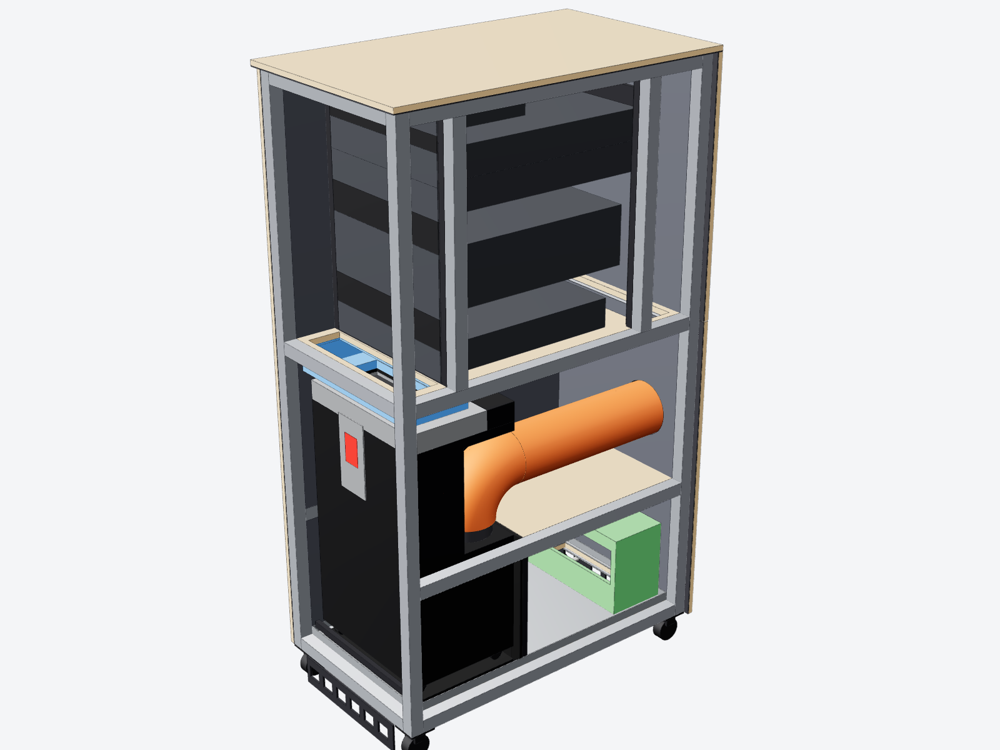

# SRA-16: silent 16 RU server rack with an integrated Dimplex AC bay

A sealed, acoustically lined server cabinet. The existing **Dimplex GDC14RBA** portable air conditioner (4.0 kW, 476 × 358 × 840 mm) sits in the lower bay and cools the rack in a **closed loop**. Its hot exhaust is ducted out of the rear. The condensate drains from the bottom, and **16 RU** of 19-inch space sits above.



| | |
|---|---|
| External | **650 W × 1100 D × 1904 H mm** (+36 mm handles, +60 mm exhaust spigot) |
| Rack | 16 RU, EIA-310, 700 mm rail spacing, 130 mm cold plenum, 154 mm hot plenum |
| Cooling | Closed loop through the AC evaporator. Design IT load 2.0-2.5 kW continuous, about 3 kW peak. |
| Exhaust | Ø150 spigot on the rear panel, 762 mm above floor, 194.5 mm in from the left edge (viewed from behind) |
| Drain | 16 mm barb at the rear, 60 mm above floor. Full-floor stainless drip tray + leak sensor. |
| Acoustics | 15 ply + 5 kg/m² MLV + 40 mm FR melamine foam. Lined labyrinth intake. About 25-30 dB(A) reduction expected. |
| Mass / cost | About 182 kg empty (+31.5 kg AC). Materials about AUD 4.7k indicative. |

## Open it in Fusion

**Option 1 (fastest):** open `cad/exports/SilentRackAC.step` with **File → Open → Open from my computer…**. Fusion converts it into a native design with all 135 parts named and coloured, grouped into 8 components. Save it to your project.

**Option 2 (native build with editable parameters):**

1. In Fusion, open **Utilities → Add-Ins → Scripts and Add-Ins** (Shift+S).
2. Click **+ → Script or add-in from device**, select the `cad/fusion/SilentRackAC` folder, and run it.
3. The script:
   - builds the rack in a **new** design (your open documents are never touched);
   - adds 46 `sr_*` user parameters;
   - checks every body's volume against this export.
4. To change the design, do either of these, then run the script again:
   - edit `DEFAULTS` in `rack_layout.py`; or
   - edit any `sr_*` value under **Modify → Change Parameters**, with that design still active. The script reads the `sr_*` values and builds a fresh design.

## Before you cut anything

The rating-plate dimensions are certain. Everything else about the AC was measured from photos and the Dimplex manual. **Tape-check M1-M8 in [docs/DESIGN.md §3](docs/DESIGN.md#3-measurements-to-confirm-before-cutting-tape-check)**, update `rack_layout.py`, and regenerate.

## What's here

| Path | What |
|---|---|
| `cad/fusion/SilentRackAC/` | Fusion script + `rack_layout.py` (**single source of truth** for all geometry) |
| `cad/exports/SilentRackAC.step` | STEP assembly (named, coloured) |
| `cad/exports/SilentRackAC.glb` | glTF for web viewers and renders |
| `drawings/CP-SRA16-GA-001.svg/.png` | A3 general arrangement at 1:15: front, section A-A with airflow, rear, plan C-C |
| `bom/BOM.md`, `bom/BOM.csv`, `bom/cut_list.csv` | Purchase list, cut list, sheet nesting, mass |
| `docs/DESIGN.md` | Design basis: airflow, thermal, acoustics, drain, controls, build order, commissioning |
| `renders/` | Renders + voxel airflow-zone sections |
| `tools/` | Build, verify, draw, BOM and render scripts |

## Regenerate everything

```bash
pip install cadquery scipy matplotlib pillow
python3 tools/build_cadquery.py        # solids, interference check, STEP + GLB, expected volumes
python3 tools/zone_check.py            # airflow zones sealed? (voxel flood-fill)
python3 tools/test_fusion_script.py    # Fusion script against a stand-in adsk API
python3 tools/make_drawings.py         # A3 GA drawing
python3 tools/make_bom.py              # BOM, cut list, mass
node tools/render/render.mjs           # renders (Playwright + Chromium)
```

Override parameters on the command line, for example `python3 tools/build_cadquery.py ru_count=17`.

## Verification

- 0 interferences between the 135 solids.
- All 10 airflow-zone checks pass: cold and hot zones are separate, and the condenser zone is on room air.
- STEP round-trip volume matches exactly.
- The Fusion script passes the stand-in API test. It has not yet been run in Fusion itself.
