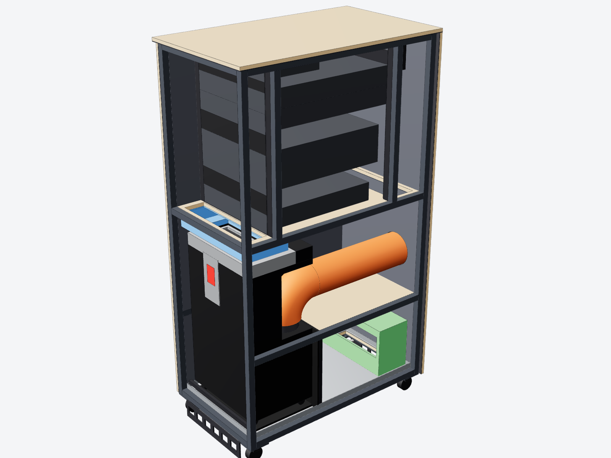

# SRA-16: silent 16 RU server rack with an integrated Dimplex AC bay

A sealed, acoustically lined server cabinet. The existing **Dimplex GDC14RBA** portable air conditioner (4.0 kW, 476 × 358 × 840 mm) sits in the lower bay and cools the rack in a **closed loop**. Its hot exhaust is ducted out of the rear. The condensate drains from the bottom, and **16 RU** of 19-inch space sits above.



| | |
|---|---|
| External | **622.4 W × 1072.4 D × 1870.4 H mm** (+36 mm handles, +60 mm exhaust spigot) |
| Rack | 16 RU, EIA-310, 700 mm rail spacing, 130 mm cold plenum, 174 mm hot plenum |
| Cooling | Closed loop through the AC evaporator. Design IT load 2.0-2.5 kW continuous, about 3 kW peak. |
| Exhaust | Ø150 spigot on the rear skin, 752 mm above floor, 180.7 mm in from the left edge (viewed from behind) |
| Drain | 16 mm barb at the rear, 60 mm above floor, 136.2 mm from the right edge (viewed from behind). Full-floor stainless drip tray + leak sensor. |
| Frame | Welded 30 × 30 × 2.0 steel SHS, 43 kg. Full cut list and weld plan: [drawings/CP-SRA16-FRM-001.pdf](drawings/CP-SRA16-FRM-001.pdf), [docs/FRAME_WELD_PLAN.md](docs/FRAME_WELD_PLAN.md) |
| Skins | Laser-cut 1.2 mm steel, 46 pieces, none larger than 1200 × 800, every hole cut. DXFs: [cad/dxf/SRA16_sheet_metal_DXF.zip](cad/dxf/SRA16_sheet_metal_DXF.zip); drawings: [drawings/CP-SRA16-SMP-001.pdf](drawings/CP-SRA16-SMP-001.pdf); notes: [docs/SHEET_METAL.md](docs/SHEET_METAL.md) |
| Printed parts | Cold-air hood, drop collar and keepers (PETG); exhaust elbow and wall spigot (ASA). 14 pieces on 10 plates, sectioned for a **Bambu Lab X1 Carbon**, no supports. STLs: [cad/print/SRA16_print_x1c.zip](cad/print/SRA16_print_x1c.zip); notes: [docs/PRINTED_PARTS.md](docs/PRINTED_PARTS.md) |
| Acoustics | 1.2 mm steel + 5 kg/m² MLV + 30 mm FR melamine foam. Lined labyrinth intake. About 25-30 dB(A) reduction expected. |
| Mass / cost | About 193 kg empty (+31.5 kg AC). Materials about AUD 5.1k indicative. |

## Open it in Fusion

**Option 1 (fastest):** open `cad/exports/SilentRackAC.step` with **File → Open → Open from my computer…**. Fusion converts it into a native design with all 164 parts named and coloured, grouped into 8 components. Save it to your project.

**Option 2 (native build with editable parameters):**

1. In Fusion, open **Utilities → Add-Ins → Scripts and Add-Ins** (Shift+S).
2. Click **+ → Script or add-in from device**, select the `cad/fusion/SilentRackAC` folder, and run it.
3. The script:
   - builds the rack in a **new** design (your open documents are never touched);
   - adds 55 `sr_*` user parameters;
   - checks every body's volume against this export.
4. To change the design, do either of these, then run the script again:
   - edit `DEFAULTS` in `rack_layout.py`; or
   - edit any `sr_*` value under **Modify → Change Parameters**, with that design still active. The script reads the `sr_*` values and builds a fresh design.

## Before you cut anything

The rating-plate dimensions are certain. Everything else about the AC was measured from photos and the Dimplex manual. **Tape-check M1-M8 in [docs/DESIGN.md §3](docs/DESIGN.md#3-measurements-to-confirm-before-cutting-tape-check)**, update `rack_layout.py`, and regenerate.

## What's here

| Path | What |
|---|---|
| `cad/fusion/SilentRackAC/` | Fusion script + `rack_layout.py` (**single source of truth** for all geometry) |
| `cad/exports/SilentRackAC.step` | STEP assembly (named, coloured) |
| `cad/exports/SilentRackAC.glb` | glTF for web viewers and renders |
| `drawings/CP-SRA16-GA-001.svg/.png` | A3 general arrangement at 1:15: front, section A-A with airflow, rear, plan C-C |
| `bom/BOM.md`, `bom/BOM.csv`, `bom/cut_list.csv` | Purchase list, cut list, sheet nesting, mass |
| `drawings/CP-SRA16-FRM-001.pdf` (+ `_s1..s6.svg`) | Frame weld pack, 6 × A3: GA + marks, side frames, box, weld details + WPS, cut list + nesting, drilling |
| `docs/FRAME_WELD_PLAN.md`, `bom/frame_*.csv` | Weld plan (procedure, sequence, checks, estimate); cut list, drilling, weld schedule and nesting as CSV |
| `drawings/CP-SRA16-SMP-001.pdf` (+ `_s1..s6.svg`) | Sheet-metal pack, 6 × A3: skin layout + parts list, flat patterns, rails + hardware + details, nesting |
| `cad/dxf/` (`cut/`, `info/`, `nest/`, zip), `docs/SHEET_METAL.md`, `bom/sheet_metal_*.csv` | Laser-cutting DXFs (1:1 mm), per-part list and nests on 1200 × 800 blanks |
| `cad/exports/SRA16_frame_weldment.step`, `cad/exports/frame_members/` | Frame weldment (true SHS, holes) and one STEP per mark for tube laser cutting |
| `cad/print/` (`stl/`, zip, STEP, report), `docs/PRINTED_PARTS.md`, `bom/printed_parts.csv` | 3D-printed parts: one STL per piece in print orientation, plates, Bambu Studio settings, assembly, checks |
| `docs/DESIGN.md` | Design basis: airflow, thermal, acoustics, drain, controls, build order, commissioning |
| `renders/` | Renders + voxel airflow-zone sections |
| `tools/` | Build, verify, draw, BOM and render scripts |

## Regenerate everything

```bash
pip install cadquery scipy matplotlib pillow
python3 tools/build_cadquery.py        # solids, interference check, STEP + GLB, expected volumes
python3 tools/zone_check.py            # airflow zones sealed? (voxel flood-fill)
python3 tools/test_fusion_script.py    # Fusion script against a stand-in adsk API
python3 tools/make_drawings.py         # A3 GA drawing
python3 tools/make_weld_pack.py        # frame weld pack: 6 A3 sheets + PDF, CSVs, weldment STEP
python3 tools/make_sheet_pack.py       # sheet-metal pack: DXFs, nests, 6 A3 sheets + PDF, CSVs
python3 tools/make_print_pack.py       # printed parts: STLs sectioned for the X1C, zip, STEP, plates, checks
python3 tools/make_bom.py              # BOM, cut list, mass (reads the print pack report)
node tools/render/render.mjs           # renders (Playwright + Chromium)
```

Override parameters on the command line, for example `python3 tools/build_cadquery.py ru_count=17`.

## Verification

- 0 interferences between the 164 solids.
- All 10 airflow-zone checks pass: cold and hot zones are separate, and the condenser zone is on room air.
- STEP round-trip volume matches exactly.
- The Fusion script passes the stand-in API test. It has not yet been run in Fusion itself.
- Weldment checks pass: every rail and upright welded at both ends, no rivnut clashes, valid STEP files.
- Sheet-metal checks pass:
  - every blank fits 1200 × 800;
  - every frame rivnut has a matching hole;
  - holes clear edges, bends and each other;
  - the 19-inch rail bolts match all four uprights.
- Printed-parts checks pass:
  - every piece fits the X1C (250 mm cube, clear of the no-print corner) and prints without supports;
  - every STL is closed and matches its solid;
  - no clash with the rest of the rack with the collar down, raised on its keepers, or hanging with the AC out;
  - the fits to the AC spigot, the duct, the shelf opening and the rear-skin bolt holes are checked against the model.
