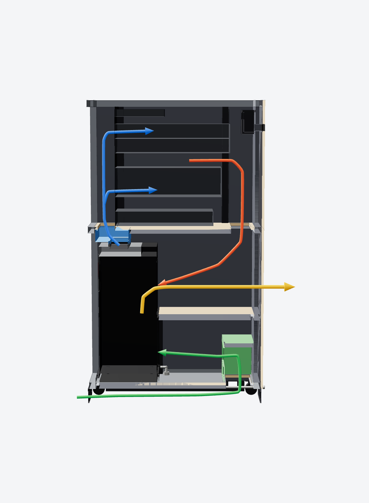
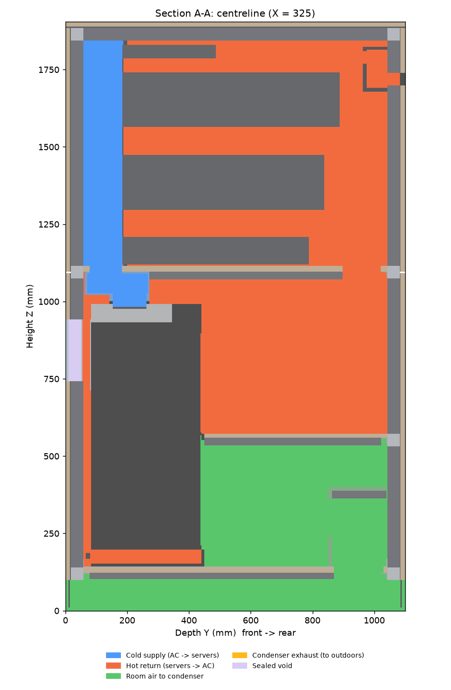

# SRA-16 Silent AC Rack: design basis

| | |
|---|---|
| Document | CP-SRA16-DES-001, Rev A (concept) |
| Geometry source | `cad/fusion/SilentRackAC/rack_layout.py` v1.0.0 |
| Drawing | `drawings/CP-SRA16-GA-001.svg` (A3, 1:15) |
| Status | Concept. Tape-check the AC dimensions in §3 before cutting panels. |

## 1. Brief

Build a server rack that:

- houses the existing **Dimplex GDC14RBA** portable air conditioner in the lower section;
- takes the AC's **hot exhaust** out of the cabinet;
- has a **condensate drain line at the bottom**;
- gives **at least 16 RU** of 19-inch rack space above the AC;
- is **quiet**, containing both server fan noise and AC noise.

The result is a single 650 W × 1100 D × 1904 H mm cabinet. The AC bay sits at the bottom and 16 RU sit on top. It is a sealed, acoustically lined enclosure, and the AC cools the rack in a **closed air loop**. The only openings to the room are a lined condenser air intake in the plinth, the insulated exhaust duct, a brush cable entry and the drain.

## 2. The air conditioner

| Data | Value | Source |
|---|---|---|
| Model | Dimplex GDC14RBA, single-hose portable, R410A 485 g | rating plate (photo) |
| Cooling capacity | 4.0 kW (EN14511) | rating plate |
| Power | 1660 W (EN14511) / 1700 W rated, 220-240 V 50 Hz | rating plate |
| Size, mass | 476 W × 358 D × 840 H mm, 31.5 kg | rating plate |
| Air flow | ~420-450 m³/h (family spec) | Dimplex manual |
| Cooling operating range | 17-43 °C | Dimplex manual |
| Cold air out | Louvres on top, toward the front | photos + manual (item 3) |
| **Cool inlet** (evaporator) | Upper rear grille + side-slide filter | manual items 7-8 |
| **Hot inlet** (condenser) | Lower rear grille + filter | manual items 9, 11 |
| **Exhaust** | Ø150 spigot in a notch at the **rear-right** corner, **pointing up** | photos (tape across rim) + manual |
| **Drain plug** | Bottom rear-left, ~40 mm above floor | photo 1 + manual item 10 |
| Display / IR receiver | Front, just below the top cover | photos |
| Fans | "MOTOR UP" (evaporator) and "MOTOR DOWN" (condenser) | wiring diagram |

Manual: [Dimplex GDC9RWA / GDC12RBA / GDC14RBA instructions (ManualsLib)](https://www.manualslib.com/manual/748067/Dimplex-Gdc9rwa.html). The manual lists a filter on each side of the unit, pulled out upward, and a 400 mm wall clearance for room use.

## 3. Measurements to confirm before cutting (tape check)

Only the rating-plate numbers are certain. The rest were estimated from the photos and the manual's parts drawing. Each one is a parameter in `rack_layout.py`: change the value and re-run, and the model, drawing and BOM all update.

| # | Measure (AC on its own castors, on the floor) | Model value | Parameter | Confidence |
|---|---|---|---|---|
| M1 | Exhaust spigot OD | 150 | `ac_exh_od` | good (tape) |
| M2 | Floor to **top of exhaust spigot** | 460 | `ac_split_z` + `ac_exh_collar_h` | ±30 |
| M3 | Floor to the **split between the upper and lower rear grilles** (partition height) | 420 | `ac_split_z` | ±30 |
| M4 | Rear-right notch: width from the right side × depth from the back | 215 × 178 | `ac_notch_w`, `ac_notch_d` | ±15 |
| M5 | Floor to the underside of the top box over the notch | 751 | `ac_notch_top_z` | ±20 |
| M6 | Top louvre opening: width × depth, and front edge from the AC front | 340 × 110 @ 70 | `ac_out_*` | ±20 |
| M7 | Drain plug centre: from the left side, and height | 30, 40 | `ac_drain_x`, `ac_drain_z` | ±10 |
| M8 | Display centre: from the left side, and height | 200, 690 | `ac_disp_*` | ±30 |

Tolerance built in: 29 mm side gaps, a 25 mm front gap, 80 mm above the AC for the louvres, and the exhaust elbow clears the top box by about 70 mm. M2 and M3 matter most. They set the partition and gasket line and the height of the exhaust duct.

## 4. Air paths (closed loop)

| Path | Route |
|---|---|
| **Cold supply** (blue) | AC top louvres → sealed **cold hood** (drop collar + EPDM gasket on the AC top) → opening in the divider shelf → **front plenum** (130 mm) → server intakes |
| **Hot return** (red) | Server exhausts → **rear plenum** (154 mm) → rear opening in the shelf → upper-rear bay → AC **upper (evaporator) grille** |
| **Room air** (green) | Perforated plinth skirts → under the bay floor (lined) → floor opening → **lined riser box** (two 90° turns) → condenser zone under the partition → AC **lower (condenser) grille** |
| **Exhaust** (amber) | AC spigot (in the notch, pointing up) → 150 mm 90° elbow (R150) → insulated Ø150 duct at 762 mm → flanged spigot in the rear panel → acoustic flex duct → window or wall vent |

The zones are separated as follows:

- **Cold and hot:** the shelf, the cold hood, the IT equipment plus blanking panels, and the front air dams (rail spacers, top and bottom dams).
- **Hot return and condenser zone:** a docking frame at the AC's back:
  - a 12 mm ply partition with an EPDM gasket at the grille split (M3);
  - two gasketed docking posts at the AC's rear corners;
  - a brush strip under the AC's rear edge.

The AC is pushed back into the gaskets and held by a retention bar with toggle clamps. To service it, lift the hood collar, release the bar and roll the AC out.

**Verified in CAD:** `tools/zone_check.py` voxelises every part on a 2.5 mm grid and flood-fills the air spaces. All ten checks pass:

| Zone | Air volume | Result |
|---|---|---|
| Cold supply (hood + front plenum) | 58.8 L | sealed from the room and from the hot zone |
| Hot return (rack, rear plenum, bay) | 401.2 L | one connected loop, sealed from the room and the condenser |
| Condenser zone (incl. plinth labyrinth) | 195.8 L | fed with room air only |
| Exhaust duct | 15.3 L | sealed from the loop, vents out the rear |

## 5. Dimensions

| Level | Z (mm) |
|---|---|
| Floor / castors | 0-100 (levelling castors, plinth intake void) |
| Bay floor, drip tray, isolation mat | 140 / 142 / 152 |
| AC | 152 → 992 |
| Partition (grille split) | 560 → 572 |
| Exhaust duct centreline | 762 |
| Cold hood / shelf lining / shelf ply | 992-1097 / 1072-1097 / 1097-1115 |
| **16 RU** | **1120 → 1831.2** |
| Top frame / top panel | 1846.2-1886.2 / 1904.2 |

- **Width:** 650 external, 534 internal. The wall build-up is 15 ply + 3 MLV + 40 foam.
- **Depth:** 1100 external, 984 internal: 130 front plenum + 700 rail spacing + 154 rear plenum. That suits typical 2U servers up to about 750 mm deep. Change `rail_spacing` or `ext_d` for other gear.
- **17 RU:** fits under 2.0 m if you set `ru_count = 17`, giving 1949 mm overall.

## 6. Thermal

- **Capacity.** The rating is 4.0 kW, but that includes latent (dehumidifying) duty. Once the sealed loop is dry, the load is almost all sensible, and a single-hose portable AC realistically delivers **about 2.5-3 kW sensible**. The evaporator fan (about 70 W) is inside the loop.
- **Design IT load:** 2.0-2.5 kW continuous and about 3 kW peak. Above that, add a second unit or use a split system.
- **Loop temperatures.** The servers and the AC are in series, so both see the same air flow (about 450-550 m³/h). At 2.5 kW the air rises about 15 K across the IT, so a 20 °C supply gives about 35 °C return. That return is inside the AC's 17-43 °C cooling range and close to its rating condition.
- **Settings:**
  - Mode: COOL. Fan: HIGH.
  - Setpoint about 26 °C. The AC senses the **return** air, so this keeps the server inlets around 18-24 °C.
  - Check against the cold-aisle sensor and adjust.
- **Condensation.** It only happens during the first pull-down or if room air leaks in. The loop stays dry after that. The outer skins sit near room temperature behind 40 mm of foam, so they won't sweat.
- **Single-hose side effect.** The unit exhausts about 400 m³/h of room air outdoors, and outside air leaks back into the room to replace it. Option: duct the plinth intake from outdoors as well, which gives dual-duct operation and higher efficiency.
- **Failure mode.** If the AC stops, the sealed box heats up within minutes. That is why the design includes monitoring, alerts and automatic IT shutdown (§9).

## 7. Acoustics

| Measure | Detail |
|---|---|
| Mass | 15 mm birch ply + 5 kg/m² MLV, about 15 kg/m² in total |
| Absorption | 40 mm melamine foam in every frame bay; 25 mm under the shelf and partition; 20 mm under the floor |
| Sealing | Double EPDM door seals, compression latches, acoustic sealant on all joints. No line-of-sight openings. |
| Openings | Room air enters through a 2-bend lined labyrinth in the plinth. The condenser exhaust leaves through an insulated duct to outdoors. Cables enter through a brush strip and a lined chamber. |
| Vibration | The AC stands on a 10 mm neoprene/Sorbothane mat. The cabinet sits on levelling feet with the castors retracted. |

Mass-law transmission loss of the wall is about 19 / 25 / 31 / 37 dB at 125 / 250 / 500 / 1000 Hz. The lining turns that into an insertion loss of about 12 dB at 125 Hz and 25-35 dB from 500 Hz up.

**Expect about 25-30 dB(A) overall.** Typical 2U servers plus the AC measure about 65-70 dB(A) in the open. Enclosed, they should drop to roughly **40-45 dB(A) at 1 m**, about the level of a quiet office. The main residual will be the compressor's low-frequency hum. Keeping the server inlets cool also keeps the server fans slow, which reduces the noise at its source.

## 8. Drainage

- Remove the AC's bottom drain plug and fit a 16 mm hose. It runs to a **tundish and 25 mm bulkhead** in the rear-left of the stainless **drip tray**, which covers the whole bay floor with a 25 mm upstand. From there it drops through the floor and runs in the plinth to a **16 mm barb at the rear**, 60 mm above the floor, 117 mm from the right edge as seen from behind.
- The barb is only 60 mm up, so run the hose to a **floor waste lower than that**. Otherwise use the optional **mini condensate pump** or a bucket with a level sensor.
- Why a continuous drain: the unit's "water full" switch stops the compressor when its internal tank fills. On a 24/7 server rack that stop would be an outage.
- A leak sensor in the tray reports to the monitor.

## 9. Electrical and controls

- **Circuits.** Put the AC (1.7 kW, about 7.5 A) on its own 10 A GPO. Put the IT load on separate circuits or a UPS. Total demand can reach about 4.5 kW, so have an electrician confirm circuit capacity. Do not run the AC from the IT UPS.
- **Monitor.** An ESP32 running ESPHome (about AUD 85) reads:
  - cold-aisle, hot-aisle and condenser-zone temperatures;
  - the tray leak sensor;
  - two door reed switches.

  It also has an **IR LED aimed at the AC's receiver**, and it can shut the servers down through NUT or IPMI.
- **Automatic restart.** Portable ACs often stay off after a power cut. The monitor re-sends POWER, COOL, HIGH and the setpoint when power returns, and alarms if the cold aisle goes above 30 °C.
- **Viewing window.** The lower door has a double-glazed polycarbonate window (140 × 200) over the AC display. You can read the unit's temperature and use the IR remote through it.

## 10. Construction

The frame is 40 × 40 aluminium T-slot, bolted, with no welding. Panels mount on the outside, and foam fills the frame bays. For production runs, the same geometry works as welded 40 × 40 × 2 SHS.

Build order:

1. Confirm M1-M8 and update `rack_layout.py`, then run `tools/build_cadquery.py`, `tools/make_drawings.py` and `tools/make_bom.py`.
2. Cut the frame to `bom/cut_list.csv` and assemble it square.
3. Fit the castors, floor cleats, floor ply, drip tray and drain bulkhead.
4. Fit the mid rails, the partition with its lining, the docking posts, gaskets and brush strip.
5. Fit the shelf cleats, shelf and lining, and the cold hood with its drop collar.
6. Fit the rack uprights, rail spacers (air dams) and the 19-inch strips.
7. Fit the panels: MLV bonded to the ply, the foam, and acoustic sealant on every joint.
8. Fit the exhaust elbow, duct and wall spigot, with insulation. Seal the penetration.
9. Fit the riser box and plinth skirts, then the cable box and brush strip.
10. Hang the doors: hinges, cam latches, seals and window.
11. Roll the AC in:
    1. Lift the hood collar.
    2. Push the AC back into the gaskets and clamp the retention bar.
    3. Lower the collar.
    4. Connect the exhaust elbow and drain hose.

## 11. Commissioning

| Test | Pass criterion |
|---|---|
| Smoke-pencil leak test at the door seals, docking frame and hood | no visible draw-through |
| 24 h temperature log at full IT load | cold aisle 18-27 °C; AC compressor not short-cycling |
| Sound at 1 m, doors open vs closed | about 25 dB(A) or more reduction |
| Pour 1 L into the tray | drains away and the leak alarm fires |
| Pull the mains plug, then restore it | the monitor restarts the AC within 1 minute |

## 12. CAD verification performed

| Check | Result |
|---|---|
| Interference (all 135 solids, OCC booleans) | 0 clashes |
| Airflow zone flood fill (§4) | 10 / 10 pass |
| STEP round-trip | 137 solids, total volume identical (0.000 %) |
| Fusion script (stand-in API test) | 135/135 bodies, volumes within 0.5 %, `sr_*` override and Y-up paths pass |
| Layout rules (`validate()`) | OK: side gaps, elbow vs top box, duct vs partition and shelf, plenums, height |

The Fusion script was not run inside Fusion from here. It shows its own volume cross-check when it finishes; if anything is off, paste that message back.

## 13. Risks and open items

- The AC dimensions in §3 are unverified. They are the largest source of error.
- **Capacity limit.** A single-hose portable unit is a comfort appliance. Above about 2.5 kW of IT load, or for critical uptime, move to a split system or an in-row unit.
- **Filters.** Clean them monthly. That means rolling the AC out; access takes about 2 minutes.
- **Fire.** Use FR melamine foam (not PU egg-crate foam) and keep ducts clear of cables. R410A is A1 (non-flammable).
- **Not certified.** This is a one-off build. A product would need electrical compliance (AS/NZS 3000 installation, RCM for any supplied electricals) and a formal thermal test.

## 14. Productisation notes

The model is fully parametric: RU count (12-20), width (600-700), depth (900-1200) and wall build-up. That makes a "silent rack with integrated cooling" product family straightforward.

- **Materials:** about AUD 4.7k at retail prices (see `bom/BOM.md`); expect less at volume.
- **For a sellable kit:**
  - CNC-cut ply panels and foam (the cut list is already generated);
  - a welded SHS frame;
  - an injection-moulded or 3D-printed cold hood;
  - a standard 150 mm exhaust kit;
  - the ESP32 monitor.
- **To validate:** measure dB(A) and thermal performance on the prototype. Those figures are the data a product sheet would need.
