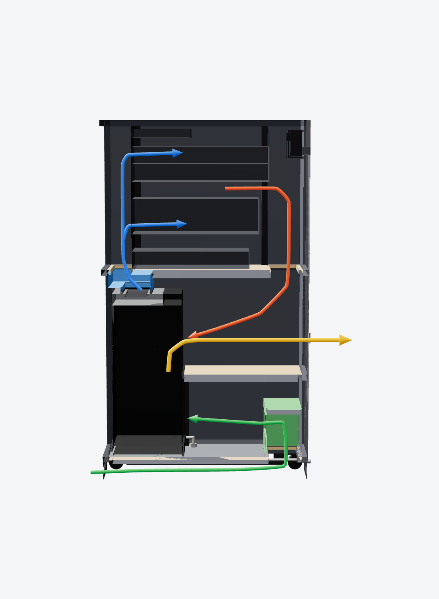
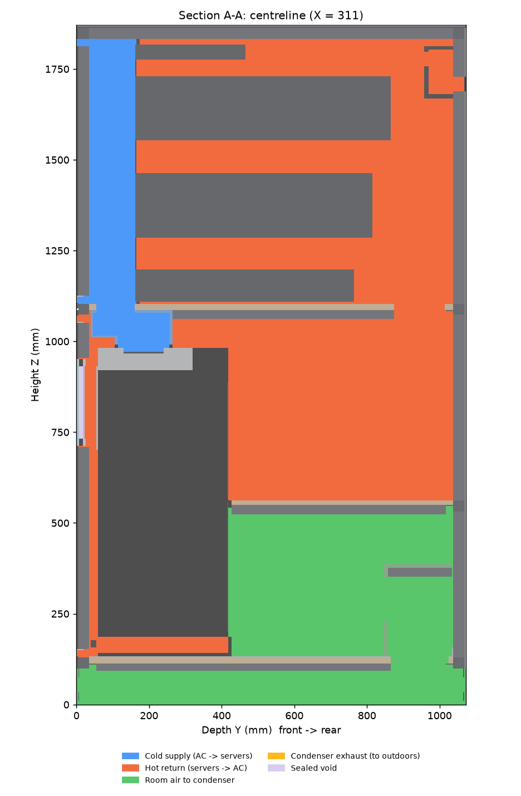

# SRA-16 Silent AC Rack: design basis

| | |
|---|---|
| Document | CP-SRA16-DES-001, Rev A (concept) |
| Geometry source | `cad/fusion/SilentRackAC/rack_layout.py` v1.2.0 |
| Drawing | `drawings/CP-SRA16-GA-001.svg` (A3, 1:15) |
| Frame | Welded 30 × 30 × 2.0 SHS: weld pack `drawings/CP-SRA16-FRM-001.pdf` (6 sheets) and `docs/FRAME_WELD_PLAN.md` |
| Skins | Laser-cut 1.2 mm steel, every piece within 1200 × 800: sheet-metal pack `drawings/CP-SRA16-SMP-001.pdf` (6 sheets), DXFs in `cad/dxf/`, `docs/SHEET_METAL.md` |
| Controls | ESP32-S3 rack node + 4.3 in touchscreen: `drawings/CP-SRA16-ELC-001.pdf` (5 sheets), firmware in `firmware/`, `docs/ELECTRONICS.md` |
| Status | Concept. Tape-check the AC dimensions in §3 before cutting panels. |

## 1. Brief

Build a server rack that:

- houses the existing **Dimplex GDC14RBA** portable air conditioner in the lower section;
- takes the AC's **hot exhaust** out of the cabinet;
- has a **condensate drain line at the bottom**;
- gives **at least 16 RU** of 19-inch rack space above the AC;
- is **quiet**, containing both server fan noise and AC noise.

The result is a single 622.4 W × 1072.4 D × 1870.4 H mm cabinet. The AC bay sits at the bottom and 16 RU sit on top. It is a sealed, acoustically lined enclosure, and the AC cools the rack in a **closed air loop**. The only openings to the room are a lined condenser air intake in the plinth, the insulated exhaust duct, a brush cable entry and the drain.

## 2. The air conditioner

| Data | Value | Source |
|---|---|---|
| Model | Dimplex GDC14RBA, single-hose portable, R410A 485 g | rating plate (photo) |
| Cooling capacity | 4.0 kW (EN14511) | rating plate |
| Power | 1660 W (EN14511) / 1700 W rated, 220-240 V 50 Hz | rating plate |
| Size, mass | 476 W × 358 D × 840 H mm, 31.5 kg | rating plate |
| Air flow | ~420-450 m³/h (family spec) | Dimplex manual |
| Cooling operating range | 17-43 °C | Dimplex manual |
| Cold air out | Louvres on top, toward the front | photos + manual (item 3) |
| **Cool inlet** (evaporator) | Upper rear grille + side-slide filter | manual items 7-8 |
| **Hot inlet** (condenser) | Lower rear grille + filter | manual items 9, 11 |
| **Exhaust** | Ø150 spigot in a notch at the **rear-right** corner, **pointing up** | photos (tape across rim) + manual |
| **Drain plug** | Bottom rear-left, ~40 mm above floor | photo 1 + manual item 10 |
| Display / IR receiver | Front, just below the top cover | photos |
| Fans | "MOTOR UP" (evaporator) and "MOTOR DOWN" (condenser) | wiring diagram |

Manual: [Dimplex GDC9RWA / GDC12RBA / GDC14RBA instructions (ManualsLib)](https://www.manualslib.com/manual/748067/Dimplex-Gdc9rwa.html). The manual lists a filter on each side of the unit, pulled out upward, and a 400 mm wall clearance for room use.

## 3. Measurements to confirm before cutting (tape check)

Only the rating-plate numbers are certain. The rest were estimated from the photos and the manual's parts drawing. Each one is a parameter in `rack_layout.py`: change the value and re-run, and the model, drawing and BOM all update.

| # | Measure (AC on its own castors, on the floor) | Model value | Parameter | Confidence |
|---|---|---|---|---|
| M1 | Exhaust spigot OD | 150 | `ac_exh_od` | good (tape) |
| M2 | Floor to **top of exhaust spigot** | 460 | `ac_split_z` + `ac_exh_collar_h` | ±30 |
| M3 | Floor to the **split between the upper and lower rear grilles** (partition height). Also frame **hold point H1**: the mid rails and partition ledges are cut to it. | 420 | `ac_split_z` | ±30 |
| M4 | Rear-right notch: width from the right side × depth from the back | 215 × 178 | `ac_notch_w`, `ac_notch_d` | ±15 |
| M5 | Floor to the underside of the top box over the notch | 751 | `ac_notch_top_z` | ±20 |
| M6 | Top louvre opening: width × depth, and front edge from the AC front | 350 × 110 @ 70 | `ac_out_*` | width measured (flap ≈ 348); depth ±20. The hood adds `hood_margin` 15 mm all round. |
| M7 | Drain plug centre: from the left side, and height | 30, 40 | `ac_drain_x`, `ac_drain_z` | ±10 |
| M8 | Display centre: from the left side, and height | 190, 690 | `ac_disp_*` | ±15 (front photos) |

Tolerance built in: 39 mm side gaps, a 25 mm front gap, 80 mm above the AC for the louvres, and the exhaust elbow clears the top box by about 70 mm. M2 and M3 matter most. They set the partition and gasket line and the height of the exhaust duct.

## 4. Air paths (closed loop)

| Path | Route |
|---|---|
| **Cold supply** (blue) | AC top louvres → sealed **cold hood** (drop collar + EPDM gasket on the AC top) → opening in the divider shelf → **front plenum** (130 mm) → server intakes |
| **Hot return** (red) | Server exhausts → **rear plenum** (174 mm) → rear opening in the shelf → upper-rear bay → AC **upper (evaporator) grille** |
| **Room air** (green) | Perforated plinth skirts → under the bay floor (lined) → floor opening → **lined riser box** (two 90° turns) → condenser zone under the partition → AC **lower (condenser) grille** |
| **Exhaust** (amber) | AC spigot (in the notch, pointing up) → 150 mm 90° elbow (R150) → insulated Ø150 duct at 752 mm → flanged spigot in the rear panel → acoustic flex duct → window or wall vent |

The zones are separated as follows:

- **Cold and hot:** the shelf, the cold hood, the IT equipment plus blanking panels, and the front air dams (rail spacers, top and bottom dams).
- **Hot return and condenser zone:** a docking frame at the AC's back:
  - a 12 mm ply partition with an EPDM gasket at the grille split (M3);
  - two gasketed docking posts at the AC's rear corners;
  - a brush strip under the AC's rear edge.

The AC is pushed back into the gaskets and held by a retention bar with toggle clamps. To service it, lift the hood collar onto its keepers, release the bar and roll the AC out; the exhaust elbow comes out with it.

**Verified in CAD:** `tools/zone_check.py` voxelises every part on a 2.5 mm grid and flood-fills the air spaces. It adds a voxel plane through every sheet thinner than the grid, so the 1.2 mm skins seal. All ten checks pass:

| Zone | Air volume | Result |
|---|---|---|
| Cold supply (hood + front plenum) | 63.6 L | sealed from the room and from the hot zone |
| Hot return (rack, rear plenum, bay) | 437.9 L | one connected loop, sealed from the room and the condenser |
| Condenser zone (incl. plinth labyrinth) | 193.9 L | fed with room air only |
| Exhaust duct | 15.3 L | sealed from the loop, vents out the rear |

## 5. Dimensions

| Level | Z (mm) |
|---|---|
| Floor / castors | 0-100 (92 mm levelling castors on 8 mm welded pads, plinth intake void) |
| Base frame (datum A = 100) | 100-130 |
| Bay floor ply (on ledges), drip tray, isolation mat | 112-130 / 132 / 142 |
| AC | 142 → 982 |
| Partition (grille split) | 550 → 562 |
| Exhaust duct centreline | 752 |
| Cold hood / shelf lining / shelf ply | 982-1062 / 1062-1087 / 1087-1105 |
| **16 RU** | **1110 → 1821.2** |
| Top frame / top skin | 1836.2-1866.2 / 1870.4 |

- **Width:** 622.4 external, 554 internal. The wall build-up is 1.2 steel + 3 MLV + 30 foam; the foam fills the 30 mm frame depth.
- **Depth:** 1072.4 external, 1004 internal: 130 front plenum + 700 rail spacing + 174 rear plenum. That suits typical 2U servers up to about 750 mm deep. Change `rail_spacing` or `ext_d` for other gear.
- **17 RU:** fits under 2.0 m if you set `ru_count = 17`, giving 1914.9 mm overall.

## 6. Thermal

- **Capacity.** The rating is 4.0 kW, but that includes latent (dehumidifying) duty. Once the sealed loop is dry, the load is almost all sensible, and a single-hose portable AC realistically delivers **about 2.5-3 kW sensible**. The evaporator fan (about 70 W) is inside the loop.
- **Design IT load:** 2.0-2.5 kW continuous and about 3 kW peak. Above that, add a second unit or use a split system.
- **Loop temperatures.** The servers and the AC are in series, so both see the same air flow (about 450-550 m³/h). At 2.5 kW the air rises about 15 K across the IT, so a 20 °C supply gives about 35 °C return. That return is inside the AC's 17-43 °C cooling range and close to its rating condition.
- **Settings:**
  - Mode: COOL. Fan: HIGH.
  - Setpoint about 26 °C. The AC senses the **return** air, so this keeps the server inlets around 18-24 °C.
  - Check against the cold-aisle sensor and adjust.
- **Condensation.** It only happens during the first pull-down or if room air leaks in. The loop stays dry after that. The outer skins sit near room temperature behind 30 mm of foam, so they won't sweat.
- **Single-hose side effect.** The unit exhausts about 400 m³/h of room air outdoors, and outside air leaks back into the room to replace it. Option: duct the plinth intake from outdoors as well, which gives dual-duct operation and higher efficiency.
- **Failure mode.** If the AC stops, the sealed box heats up within minutes. That is why the design includes monitoring, alerts and automatic IT shutdown (§9).

## 7. Acoustics

| Measure | Detail |
|---|---|
| Mass | 1.2 mm steel + 5 kg/m² MLV, about 14.4 kg/m² in total |
| Absorption | 30 mm melamine foam in every frame bay (the frame depth); 25 mm under the shelf and partition; 20 mm under the floor |
| Sealing | Double EPDM door seals, toggle (draw) latches, acoustic sealant under every joint strip. No line-of-sight openings. |
| Openings | Room air enters through a 2-bend lined labyrinth in the plinth. The condenser exhaust leaves through an insulated duct to outdoors. Cables enter through a brush strip and a lined chamber. |
| Vibration | The AC stands on a 10 mm neoprene/Sorbothane mat. The cabinet stands on the levelling castors' feet, wheels unloaded. |

Mass-law transmission loss of the wall is about 18 / 24 / 30 / 36 dB at 125 / 250 / 500 / 1000 Hz. A 1.2 mm steel skin's coincidence dip sits near 10 kHz, well above the speech band; 15 mm ply's sat at 1-2 kHz. The lining turns that into an insertion loss of about 11 dB at 125 Hz and 25-35 dB from 500 Hz up. The 30 mm lining costs about 1 dB below 500 Hz compared with the earlier 40 mm version; it does not change the overall estimate.

**Expect about 25-30 dB(A) overall.** Typical 2U servers plus the AC measure about 65-70 dB(A) in the open. Enclosed, they should drop to roughly **40-45 dB(A) at 1 m**, about the level of a quiet office. The main residual will be the compressor's low-frequency hum. Keeping the server inlets cool also keeps the server fans slow, which reduces the noise at its source.

## 8. Drainage

- Remove the AC's bottom drain plug and fit a 16 mm hose. It runs to a **tundish and 25 mm bulkhead** in the rear-left of the stainless **drip tray**, which covers the whole bay floor with a 25 mm upstand. From there it drops through the floor and runs in the plinth to a **16 mm barb at the rear**, 60 mm above the floor, 136.2 mm from the right edge as seen from behind (clear of the castor pad).
- The barb is only 60 mm up, so run the hose to a **floor waste lower than that**. Otherwise use the optional **mini condensate pump** or a bucket with a level sensor.
- Why a continuous drain: the unit's "water full" switch stops the compressor when its internal tank fills. On a 24/7 server rack that stop would be an outage.
- A float switch in the tray reports to the rack node ("water in tray" alarm).

## 9. Electrical and controls

- **Circuits.** Put the AC (1.7 kW, about 7.5 A) on its own 10 A GPO. Put the IT load on separate circuits or a UPS. Total demand can reach about 4.5 kW, so have an electrician confirm circuit capacity. Do not run the AC from the IT UPS.
- **Controls (CP-SRA16-ELC-001, `docs/ELECTRONICS.md`).** An ESP32-S3 **rack node** in the front plenum reads six DS18B20 probes - cold side top and middle and the AC supply on the front-left rail spacer; hot side top and AC return on the rear-left rail spacer; the condenser exhaust in the elbow - plus a humidity sensor, the tray float switch and the lower door. Every 5 s it decides whether the AC should run, at what setpoint and fan speed, and sends the AC's own IR remote codes from a stick-on emitter. A **4.3 in touchscreen** on the upper door shows the state and takes the settings over RS485, and links the rack to Home Assistant over Wi-Fi. The node needs neither the screen nor the network to keep the rack cool. Kit about AUD 320, 12 V, about 3 W, on the UPS.
- **Setpoint trim and eco.** At normal load the AC runs on its own thermostat; the node trims its setpoint (whole degrees) so the 10-minute average intake meets the target (22 °C). At light load (the servers warm the air by less than 4 K) eco pulls the rack 2 K below the target, switches the AC off, and on again 2 K above it - long quiet spells, with at least 15 min on and 5 min off.
- **Automatic restart.** Portable ACs come back from a power cut in standby. The node sees that the AC is not cooling (supply air vs return, exhaust vs room) and re-sends its state; with the optional mains detect it re-sends 30 s after the socket comes back. Simulated: cooling again 1.8 min after the power returns (0.5 min with mains detect).
- **Alarms and shutdown.** Intake 27 °C is a warning; 32 °C for 120 s raises an IT shutdown request - relay K1 gives a dry contact for a UPS or server input, and Home Assistant gets the same signal for NUT or ssh. Missing probes, water in the tray, a door left open, a dead AC socket and condensation risk are all alarms; unknown readings always mean AC on.
- **Viewing window.** The lower door has a double-glazed polycarbonate window (140 × 200) over the AC display. You can read the unit's temperature and use the IR remote through it.

## 10. Construction

The frame is **welded 30 × 30 × 2.0 SHS** (C350L0). It is fully detailed in weld pack **CP-SRA16-FRM-001** (`drawings/CP-SRA16-FRM-001.pdf`, six A3 sheets, and `docs/FRAME_WELD_PLAN.md`):

| | |
|---|---|
| Members | 41 in 16 marks: posts P1-P3, side rails S1-S2, cross rails C1-C4, rack uprights U1, loose rail spacers RS1, flat-bar ledges F1-F3, castor pads PL1, post caps PL2 |
| Stock | 4 × 6.5 m SHS and 2 × 6 m flat bar (nested, sheet 5) |
| Welds | 38 SHS joints welded all round, plus 10 ledge stitch runs, 4 caps and 4 pads: about 8.1 m in total. GMAW, AS/NZS 1554.1 GP. |
| Sequence | Two side frames built flat (SA-L, then SA-R as its mirror), then the box on its side, then pads and caps. Joints are numbered in a balanced order. |
| Holes | 152 × Ø9 for M6 steel rivnuts (panels, skirts, rail spacers), drilled before welding; 16 × M8 tapped in the pads |
| Mass, time | 43 kg weldment (+ 4.9 kg spacers); about 19 h for a one-off by hand |
| Hold point H1 | The mid rails and partition ledges follow M3 (§3). Cut them after the tape check. |

The switch from 40 mm T-slot changed four details. The foam is now 30 mm (the frame depth), and the inside grows by 20 mm each way. The ply floor, partition and shelf sit on 20 × 3 flat-bar ledges instead of angle cleats. The castors bolt to 8 mm pads welded under the corners. The 19-inch rail spacers are bolted rather than welded, so the rails can be packed out to 465.1 mm hole centres after welding.

The outer skins are **laser-cut 1.2 mm steel** (pack **CP-SRA16-SMP-001**, `docs/SHEET_METAL.md`). The frame and the inside are unchanged, so the outside shrank from 650 × 1100 × 1884 to 622.4 × 1072.4 × 1870.4.

| | |
|---|---|
| Parts | 28 part types, 46 pieces, 78 kg: split side and rear skins, top skin, doors, joint strips, door stiffener angles, latch keepers, window retainer, plinth skirts, drip tray, 19-inch rails |
| Size limit | Every flat blank fits 1200 × 800; the largest is 1064 × 775.7. The skins split on rail centrelines, and 50 × 1.2 strips cover the joints. |
| Holes | Every frame rivnut is matched by a Ø8 hole, checked in code. Hinge, latch, handle, window, spigot, grommet and drain holes are all cut. The split skins have R4 notches round the strip screws. |
| DXF | `cad/dxf/cut/` (cut layer only), `cad/dxf/info/` (bend lines, ID etch, notes), `cad/dxf/nest/` (11 steel + 1 stainless 1200 × 800 blanks), zipped in `cad/dxf/SRA16_sheet_metal_DXF.zip` |
| Fixing | M6 × 20 flanged button heads into the frame rivnuts. The MLV behind the skin is punched Ø8 and acts as the gasket. Hinges, toggle latches and keepers are riveted (4.8 mm), so the frame needs no extra holes. |

The cold-air hood and the exhaust parts are **3D-printed** (pack **CP-SRA16-PRT-001**, `docs/PRINTED_PARTS.md`), sectioned for a Bambu Lab X1 Carbon.

| | |
|---|---|
| Parts | P1 hood body (4 sections), P2 drop collar (2 halves), P3 keepers (2), P4 exhaust elbow (2 halves), P5 wall spigot (2), and 2 fit gauges: 14 pieces on 10 plates |
| Material | PETG on the cold side (1.35 kg, about 35 h); ASA for the exhaust, which runs up to about 60 °C (1.05 kg, about 32 h) |
| Size limit | Every piece fits 250 × 250 × 250 (the X1C's 256 mm volume less a brim margin), clear of the no-print corner, and prints without supports |
| Joints | Glued half-laps, 10 mm long, 0.2 mm clearance per face; the outside stays flush |
| Collar | A separate drop collar that slides in the hood floor and seals on the AC top under its own weight. Two turn-button keepers hold it 15 mm up while the AC is rolled. |
| Exhaust | The elbow socket fits over the AC spigot onto a conical seat. The elbow rides in with the AC: its outlet slides into the duct as the AC docks. The wall-spigot flange is drilled to the rear-skin hole pattern. |
| Files | `cad/print/stl/` (one STL per piece, in print orientation), `cad/print/SRA16_print_x1c.zip`, `cad/print/SRA16_printed_parts.step` (installed position) |

Build order:

1. Confirm M1-M8 and update `rack_layout.py`, then run `tools/build_cadquery.py`, `tools/make_drawings.py`, `tools/make_weld_pack.py`, `tools/make_sheet_pack.py`, `tools/make_print_pack.py` and `tools/make_bom.py`.
2. Fabricate the frame to the weld pack: cut, drill, bench ledges, SA-L and SA-R, box, pads and caps, then coat and fit the rivnuts. Order the laser-cut parts with the DXF zip at the same time, then have them folded and powder coated. Start the printed parts too: the two gauges first, then the plates in number order (about 67 h of printing).
3. Fit the castors (M8 into the pads), the bay floor ply on its ledges, the drip tray and the drain bulkhead.
4. Fit the partition on its ledges with its lining, the docking posts, gaskets and brush strip.
5. Fit the shelf ply on its ledges with its lining. Glue up the printed hood, screw it up to the shelf ply from below (rear row through the floor opening, front row through the driver holes), fit the keepers and drop the collar in.
6. Bolt the RS1 rail spacers (air dams) to the uprights, packed to suit, then fit the 19-inch strips.
7. Fit the skins: MLV bonded inside each skin, then the foam. Fit the side skins bottom to top with the JS strips over the joints, then the rear skins with the JR strip, then the top skin. Put acoustic sealant under every strip edge.
8. Bolt the printed wall spigot through the rear skin. Fit the internal duct, cut to length and insulated, on its inner tube, and hang the front end from the shelf in line with the elbow outlet. Seal the penetration.
9. Fit the riser box and plinth skirts SK1-SK3, then the cable box and brush strip.
10. Build and hang the doors: bond the stiffener angles, rivet the hinges and KB1 keepers, fit the window and seals. Then rivet the toggle latches to the right-hand skins and adjust them to pull the doors onto the seal. Fit the touchscreen pod (P6) on the upper door's rivnuts, the node box (P7) on the front-left rail spacer and the probe clips (P8), and run the cables as on sheet 4 of CP-SRA16-ELC-001: everything that goes into the bay passes through the hood port.
11. Roll the AC in:
    1. Fit the printed elbow on the AC spigot (it stays on the AC).
    2. Lift the hood collar onto its keepers.
    3. Push the AC back into the gaskets: the elbow outlet slides into the duct. Clamp the retention bar.
    4. Turn the keepers out so the collar drops onto the AC, then connect the drain hose.
    5. Plug in the IR emitter and stick it on the AC over its IR receiver (unplug it before rolling the AC out).

## 11. Commissioning

| Test | Pass criterion |
|---|---|
| Smoke-pencil leak test at the door seals, docking frame and hood | no visible draw-through |
| 24 h temperature log at full IT load | cold aisle 18-27 °C; AC compressor not short-cycling |
| Sound at 1 m, doors open vs closed | about 25 dB(A) or more reduction |
| Pour 1 L into the tray; lift the float switch | drains away; the "water in tray" alarm fires |
| Pull the AC's mains plug, then restore it | the rack node has the AC cooling again within 2 minutes (30 s with mains detect) |
| Electronics | the commissioning steps in `docs/ELECTRONICS.md` (probes, AC protocol, doors, shutdown relay) |

## 12. CAD verification performed

| Check | Result |
|---|---|
| Interference (all 164 solids, OCC booleans) | 0 clashes |
| Airflow zone flood fill (§4) | 10 / 10 pass |
| STEP round-trip | re-imports as 166 solids (two of the 164 parts are in two pieces), total volume within 0.002 % |
| Fusion script (stand-in API test) | 164/164 bodies, volumes within 0.5 %, `sr_*` override and Y-up paths pass |
| Layout rules (`validate()`) | OK: side gaps, elbow vs top box, duct vs partition and shelf, plenums, height, ply on ledges inside the frame depth, skin pieces within 1200 × 800, hinge and latch clearances |
| Sheet metal (`tools/sheetmetal.py`) | OK: every blank within 1200 × 800; every frame rivnut matched by a sheet hole; hole-to-edge, hole-to-bend and hole-to-hole distances; mirror twins identical hole for hole; 19-inch rail bolts match all four uprights |
| Weldment (`tools/weldment.py`) | OK: every rail and upright welded at both ends; rivnuts on adjacent faces at least 22 mm apart; weldment STEP and 15 per-mark STEP files valid |

The Fusion script was not run inside Fusion from here. It shows its own volume cross-check when it finishes; if anything is off, paste that message back.

## 13. Risks and open items

- The AC dimensions in §3 are unverified. They are the largest source of error.
- **Hold point H1:** the mid rails and partition ledges depend on M3, and so do the sheet-metal parts SL1, SL2, SR1, SR2 and RP1 (`make_sheet_pack.py` finds them by moving M3 ±30 mm). Cut, weld and laser-cut everything else first.
- **Capacity limit.** A single-hose portable unit is a comfort appliance. Above about 2.5 kW of IT load, or for critical uptime, move to a split system or an in-row unit.
- **Filters.** Clean them monthly. That means rolling the AC out; access takes about 2 minutes.
- **Fire.** Use FR melamine foam (not PU egg-crate foam) and keep ducts clear of cables. R410A is A1 (non-flammable).
- **Not certified.** This is a one-off build. A product would need electrical compliance (AS/NZS 3000 installation, RCM for any supplied electricals) and a formal thermal test.

## 14. Productisation notes

The model is fully parametric: RU count (12-20), width (600-700), depth (900-1200) and wall build-up. That makes a "silent rack with integrated cooling" product family straightforward.

- **Materials:** about AUD 5.3k at retail prices (see `bom/BOM.md`). The welded frame is about AUD 0.8k, the laser-cut, folded and coated sheet metal about AUD 1.5k and the control kit about AUD 0.3k. Expect less at volume.
- **For a sellable kit:**
  - laser-cut steel skins (the DXFs and nests are already generated) and CNC-cut foam;
  - the welded SHS frame, already detailed for production: per-mark STEP files for tube laser cutting, and a jig can be built from the side-frame sheet;
  - the cold hood, collar and exhaust parts, already printable on a desktop printer (CP-SRA16-PRT-001), or injection-moulded at volume;
  - the control electronics (CP-SRA16-ELC-001), already firmware-complete and simulated; at volume the carrier becomes a small PCB with the ESP32-S3 module on it.
- **To validate:** measure dB(A) and thermal performance on the prototype. Those figures are the data a product sheet would need.
