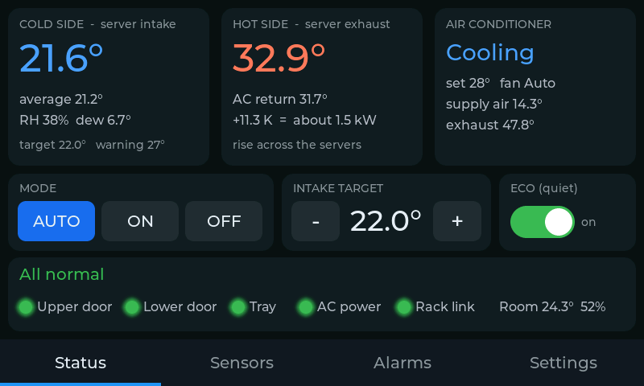
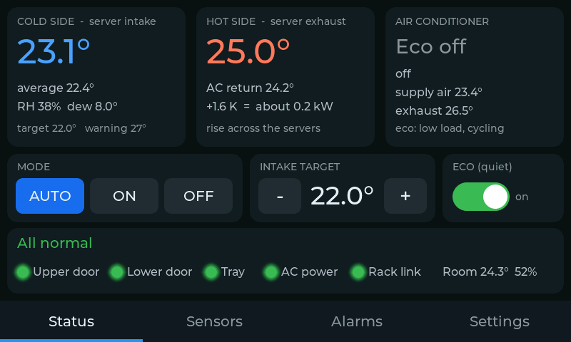
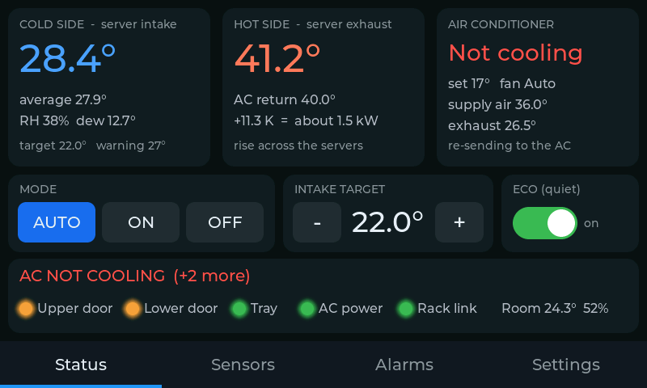
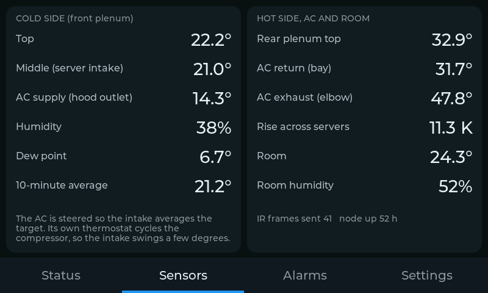
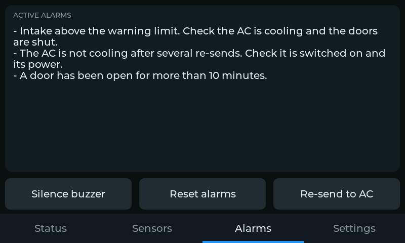
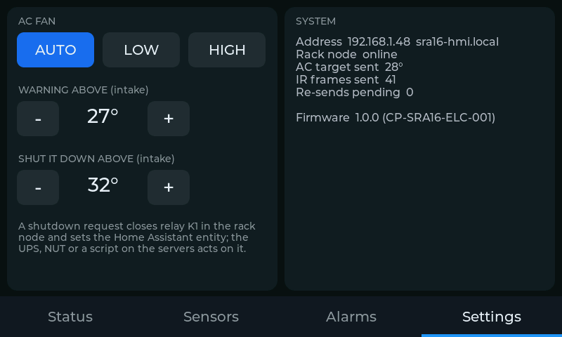
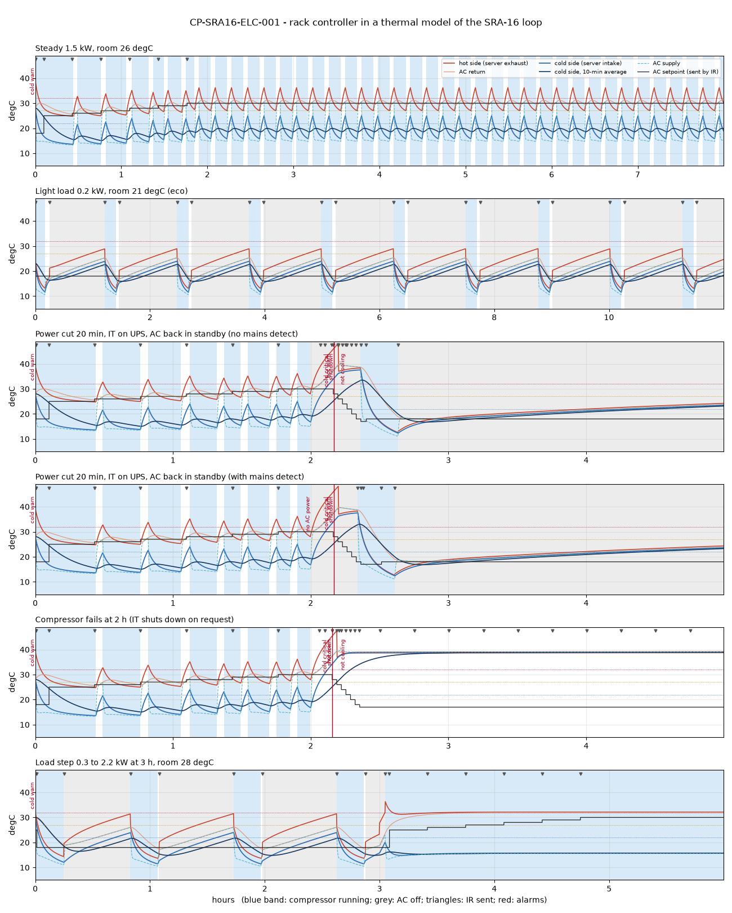

# SRA-16 - control electronics (CP-SRA16-ELC-001)

| | |
|---|---|
| Drawing | CP-SRA16-ELC-001, 5 sheets (`drawings/CP-SRA16-ELC-001.pdf`) |
| Generated | `tools/make_electronics.py` on 2026-10-01, layout v1.2.0 |
| Firmware | `firmware/sra16-node.yaml` (rack node), `firmware/sra16-hmi.yaml` (touchscreen), ESPHome 2026.6 |
| Kit cost | about AUD 317 (+ AUD 33 options), indicative - `bom/electronics.csv` |
| Power | 12 V, about 3.1 W typical, from a plug pack on the UPS-backed PDU |
| Status | prototype; SELV only - nothing in the kit touches mains |

## What it does

A small ESP32 computer inside the rack (the **rack node**) reads temperature probes on the cold side (server intakes) and the hot side (server exhausts, the AC's return and exhaust air). Every 5 seconds it decides whether the AC should run, at what setpoint and fan speed, and sends that to the AC with the AC's own infrared remote codes - so the AC is never modified. A **4.3 inch touchscreen** on the upper door shows what is happening and lets you change the settings; it talks to the node over a 4-wire RS485 cable and is also the kit's link to Wi-Fi and Home Assistant.

The node makes every decision itself: if the screen, the network or Home Assistant is down, the rack stays cooled. Anything it cannot see (a dead probe, an over-temperature) makes it turn the AC on.



*Status: cold side, hot side, AC state, quick controls*



*Eco: light load, the AC is off and the rack coasts*



*Alarm: the AC is not cooling; the node re-sends and beeps*



*Sensors: every probe, humidity, dew point, IR count*



*Alarms: what is wrong and what to check; silence, reset, re-send to the AC*



*Settings: AC fan, warning and shutdown limits, system*

## Why an ESP32 rather than a Raspberry Pi 5

Both were considered. For a controller sealed inside a rack the ESP32-S3 wins on every point that matters: it is running 1 second after power returns (a Pi takes 20-40 s and can corrupt its SD card in a power cut), it dissipates about 1 W instead of 5-10 W inside the sealed box, its RMT peripheral generates IR timing in hardware, it runs straight from 12 V, and ESPHome gives native Home Assistant integration. A Pi 5 remains a good Home Assistant host outside the rack.

## Architecture

- **Rack node** - ESP32-S3-DevKitC-1 on a 70 x 90 mm carrier board in the printed box P7, stuck by two magnets to the front face of the left front rail spacer, just above the shelf. Modbus server (address 1).
- **Touchscreen** - Waveshare ESP32-S3-Touch-LCD-4.3B in the printed pod P6 on the upper door (outside the steel, so Wi-Fi works). Modbus client; also reads the room temperature, the upper door contact, drives the buzzer and an optional beacon output.
- **Bus W1** - 4-core shielded cable: +12 V, 0 V, RS485 A/B at 19 200 baud, through a hinge loop with a GX16-4 plug so the lift-off door still lifts off.
- **AC control** - a stick-on IR emitter over the AC's receiver, on a 3.5 mm socket in the bay so the AC still rolls out for its filters (unplug, roll, plug back).
- **Shutdown** - relay K1 on the node gives a dry contact for a UPS or server input; Home Assistant sees the same request and can shut servers down over the network (NUT / ssh).

## Kit parts

| Group | Ref | Item | Spec | Qty | AUD each | AUD |  |
|---|---|---|---|---|---|---|---|
| Touchscreen | HMI | Waveshare ESP32-S3-Touch-LCD-4.3B | 800x480 IPS, GT911 touch, 7-36 V in, RS485, isolated DI/DO, 16 MB flash, 8 MB PSRAM | 1 | 79.00 | 79.00 |  |
| Touchscreen | pod | SHT41 breakout (room) | Adafruit 5776 or equal, in the pod's vented corner | 1 | 12.00 | 12.00 |  |
| Touchscreen | pod | Active buzzer 12 V, 12 mm | 85 dB, on DO0 | 1 | 2.50 | 2.50 |  |
| Touchscreen | pod | Door contact, upper door | surface reed contact (MC-38 type), closed when shut | 1 | 4.00 | 4.00 |  |
| Rack node | U1 | ESP32-S3-DevKitC-1-N8R8 | Espressif, 2 x 22 pins | 1 | 25.00 | 25.00 |  |
| Rack node | U2 | TTL-RS485 module, automatic direction, 3.3 V | SP3485 / MAX3485 class | 1 | 6.00 | 6.00 |  |
| Rack node | U3 | 5 V 1 A step-down regulator, 7-36 V in | Pololu D24V10F5 or equal | 1 | 15.00 | 15.00 |  |
| Rack node | U4 | IR receiver TSOP38238 | 38 kHz | 1 | 3.00 | 3.00 |  |
| Rack node | K1 | Relay Omron G5V-1-DC12 | SPDT, 1 A 30 VDC | 1 | 5.00 | 5.00 |  |
| Rack node | U5, Q1-Q2, D1-D3, F1 | PC817, 2 x PN2222A, 2 x 1N4148, 1N5819, PTC 0.5 A |  | 1 | 4.00 | 4.00 |  |
| Rack node | R, C | Resistors and capacitors (sheet 2 list) | 1/4 W metal film, ceramic + electrolytic | 1 | 4.00 | 4.00 |  |
| Rack node | PCB | Prototype board 70 x 90 mm, plated through | 2.54 mm grid | 1 | 3.00 | 3.00 |  |
| Rack node | J | Terminals 3.5 mm (6 x 2-way, 3 x 3-way, 1 x 4-way), JST-XH 4, 2 x 22-way sockets | pluggable or fixed | 1 | 9.00 | 9.00 |  |
| Sensors | T1-T3 | DS18B20 waterproof probe, 6 x 50 mm stainless, 1 m lead | cold side | 3 | 6.00 | 18.00 |  |
| Sensors | T4-T6 | DS18B20 waterproof probe, 6 x 50 mm stainless, 3 m lead | hot side, cut to the harness | 3 | 7.00 | 21.00 |  |
| Sensors | RH | SHT41 breakout (cold side) | Adafruit 5776 or equal, on a 0.5 m lead | 1 | 12.00 | 12.00 |  |
| Sensors | LEAK | Mini float switch, vertical, normally open | M8 stem, 52 mm; set to close as it rises | 1 | 6.00 | 6.00 |  |
| Sensors | DOOR | Door contact, lower door | surface reed contact (MC-38 type) | 1 | 4.00 | 4.00 |  |
| AC control | IR | IR emitter, stick-on, 3.5 mm mono plug | AV 'IR blaster' emitter, no built-in resistor | 1 | 6.00 | 6.00 |  |
| AC control | W4 | 3.5 mm mono socket on a 1.5 m lead | socket end in the bay, bare end to J7 | 1 | 6.00 | 6.00 |  |
| Cables | W1 | 4-core 0.22 mm2 shielded alarm cable | door bus | 2 | 1.50 | 3.00 |  |
| Cables | W1 | GX16-4 aviation connector pair, cable mount | at the hinge loop: the door lifts off | 1 | 6.00 | 6.00 |  |
| Cables | W2 | 8-core 0.22 mm2 shielded alarm cable | rear harness | 4 | 2.20 | 8.80 |  |
| Cables | W5-W7 | 2-core and 4-core 0.22 mm2 cable | leak, lower door, SHT41 leads | 4 | 1.00 | 4.00 |  |
| Cables | port | Membrane grommet 25 mm (hood port) + 20 mm spare |  | 1 | 4.00 | 4.00 |  |
| Cables | loop | Spiral wrap 10 mm, adhesive cable-tie mounts, ties, heat shrink, ferrules |  | 1 | 14.00 | 14.00 |  |
| Power | W8 | 12 V 2 A regulated plug pack, RCM, 5.5 x 2.1 | on the UPS-backed PDU | 1 | 25.00 | 25.00 |  |
| Power | W8 | DC 5.5 x 2.1 extension 2 m + socket-to-terminal pigtail |  | 1 | 8.00 | 8.00 |  |
| Options | J10 | Mains detect: 5 V USB charger (RCM) + USB-A lead to bare ends | in a double adaptor on the AC's GPO | 1 | 15.00 | 15.00 | option |
| Options | DO1 | 12 V LED beacon | on the alarm output | 1 | 18.00 | 18.00 | option |

**Kit: about AUD 317**, options AUD 33. Indicative retail, Sept 2026 - the screws and magnets for P6/P7/P8 are in `docs/PRINTED_PARTS.md`.

## Rack node carrier (sheet 2)

| Pin | Net | Goes to | Function |
|---|---|---|---|
| GPIO4 | IR_TX | Q1 base (R5) | IR emitter, 38 kHz carrier (remote_transmitter) |
| GPIO5 | IR_RX | U4 OUT | IR receiver: learning, protocol check (remote_receiver) |
| GPIO6 | OW_COLD | J5-2 | 1-Wire, cold probes T1-T3 (R1 4.7k pull-up) |
| GPIO7 | OW_HOT | J6-2 | 1-Wire, hot probes T4-T6 (R2 2.2k pull-up) |
| GPIO8 | SDA | J4-3 | I2C data, SHT41 cold-side humidity |
| GPIO9 | SCL | J4-4 | I2C clock (50 kHz on the 0.5 m lead) |
| GPIO10 | DOOR_LO | J9-1 (R11) | lower door contact, closed when shut |
| GPIO11 | LEAK | J8-1 (R9) | tray float switch, closes on water |
| GPIO12 | MAINS | U5 collector | AC socket live: optocoupler pulls low |
| GPIO13 | SD_RLY | Q2 base (R8) | SHUTDOWN relay K1 -> J3 |
| GPIO17 | TXD | U2 DI/TXD | RS485 transmit (UART1, 19200 8N1) |
| GPIO18 | RXD | U2 RO/RXD | RS485 receive |

| Conn | Type | Pins | To |
|---|---|---|---|
| J1 | 2-way terminal 3.5 mm | +12V / 0V | 12 V in: plug pack on the UPS-backed PDU (W8) |
| J2 | 4-way terminal 3.5 mm | +12V / 0V / A / B | door bus W1 to the touchscreen |
| J3 | 3-way terminal 3.5 mm | COM / NO / NC | SHUTDOWN dry contact (K1) on W2 |
| J4 | JST-XH 4-way | 3V3 / 0V / SDA / SCL | SHT41 cold-side humidity (W7) |
| J5 | 3-way terminal 3.5 mm | 3V3 / DQ / 0V | cold probes T1 T2 T3 (W3) |
| J6 | 3-way terminal 3.5 mm | 3V3 / DQ / 0V | hot probes T4 T5 T6 on harness W2 |
| J7 | 2-way terminal 3.5 mm | IR+ / IR- | IR emitter socket lead W4 |
| J8 | 2-way terminal 3.5 mm | LEAK / 0V | tray float switch (W5) |
| J9 | 2-way terminal 3.5 mm | DOOR / 0V | lower door contact (W6) |
| J10 | 2-way terminal 3.5 mm | 5V+ / 5V- | mains detect, optional (W2) |

Build order: sockets for U1, then U3 and U2, then the terminal row. With U1 out, power J1 from 12 V and check +5 V and the 12 V on J2; then fit U1 and check +3V3. Keep the 12 V wiring on the left half of the board and the 1-Wire/I2C lines short and away from K1. U1's GPIOs are 3.3 V only.

| Ref | Part | Use |
|---|---|---|
| U1 | ESP32-S3-DevKitC-1-N8R8 | the controller, on 2 x 22-way sockets |
| U2 | TTL-RS485 module, auto direction, 3.3 V | SP3485/MAX3485 class, A/B to J2 |
| U3 | 5 V 1 A step-down, 7-36 V in | Pololu D24V10F5 or equal |
| U4 | TSOP38238 | IR receiver 38 kHz, under the lid window |
| U5 | PC817 | optocoupler, mains detect |
| K1 | Omron G5V-1-DC12 | SHUTDOWN relay, SPDT 1 A 30 VDC |
| Q1, Q2 | PN2222A | IR emitter and relay drivers |
| D1 | 1N4148 | K1 flyback |
| D2 | 1N4148 | U5 LED reverse guard |
| D3 | 1N5819 | 5 V into U1: blocks back-feed from the USB port |
| F1 | PTC 0.5 A hold | door bus 12 V |
| R1 | 4.7k | 1-Wire cold pull-up |
| R2 | 2.2k | 1-Wire hot pull-up (longer bus) |
| R3, R4 | 4.7k | I2C pull-ups |
| R5, R8 | 1k | Q1, Q2 base |
| R6 | 150R 0.25 W | IR emitter current, about 22 mA peak |
| R7 | 100R | U4 supply filter |
| R9, R11, R13 | 1k | input series / U5 LED |
| R10, R12, R14 | 10k | input pull-ups |
| C1 | 100uF 25 V | 12 V bulk |
| C2 | 100uF 10 V | 5 V bulk |
| C3 | 4.7uF | U4 supply |
| C4-C7 | 100nF | input filters, U2 decoupling |

## Touchscreen pod (sheet 3)

- W1 lands on the panel's power and RS485 terminals (VIN 7-36 V, GND, A, B).
- Upper door contact: +12 V through the reed switch into DI0, DI COM to 0 V (the isolated input needs 5-36 V).
- Buzzer: +12 V to the buzzer, its other lead to DO0. Optional beacon the same way on DO1. DO COM to 0 V.
- Room SHT41 on the panel's I2C connector, in the pod's vented corner.
- USB-C for the first flash; after that, updates go over Wi-Fi.

## Installation (sheet 4)

| Id | What | x / y / z | How |
|---|---|---|---|
| T1 | Cold side top | 50 / 148 / 1790 | P8-1 clip on the front-left rail spacer; probe across the plenum |
| T2 | Cold side middle | 50 / 148 / 1465 | P8-1 clip, same face |
| T3 | AC supply | 50 / 148 / 1125 | P8-1 clip just above the shelf, tip over the hood outlet |
| RH | SHT41 cold side | 50 / 148 / 1300 | lead in a P8-1 clip, board hanging free in the air |
| T4 | Hot side top | 50 / 880 / 1790 | P8-1 clip on the rear-left rail spacer, rear face |
| T5 | AC return | 50 / 880 / 1130 | P8-1 clip on the rear-left rail spacer, just above the return opening |
| T6 | AC exhaust | 442 / 455 / 700 | 6.5 mm hole in the elbow's outer bend, probe 25 mm in, silicone |
| LK | Tray float switch | 52 / 90 / 140 | on a small alu angle bonded to the tray, front-left corner |
| DL | Lower door contact | 90 / 50 / 1004 | switch under the hood's front edge, magnet on the door lining |
| DU | Upper door contact | 60 / 30 / 1620 | switch on the door lining at the hinge side, magnet on the side lining |
| IR | IR emitter | 300 / 59 / 832 | stuck on the AC front over its IR receiver (by the display) |
| NB | Node box (P7) | 51 / 125 / 1215 | magnets on the front-left rail spacer, front face |
| POD | Touchscreen (P6) | 135 / -30 / 1505 | outside the upper door, 2 x M4 rivnuts |
| HP | Hood port | 54 / 70 / 1045 | P1-1 left end, 25 mm membrane grommet |
| HL | Hinge loop + GX16 | 40 / 50 / 1450 | 300 mm loop in spiral wrap, between the hinges |

Coordinates in mm: x from the left skin, y back from the front, z up from the floor.

| Cable | From | To | Type | m | Route |
|---|---|---|---|---|---|
| W1 | J2 (node) | touchscreen terminals | 4-core 0.22 shielded, GX16-4 inline | 1.5 | node box front slot - front-left corner of the front plenum - hinge loop 300 mm in spiral wrap at z 1450 (GX16 on the cabinet side) - upper door grommet - pod |
| W2 | J6, J3, J10 (node) | T4, T5, T6; UPS contact; mains charger | 8-core 0.22 shielded | 3.5 | bottom slot - down the front-left corner - hood port - back along the bay's left wall under the shelf (T6 on a branch tied along the exhaust duct) - up through the shelf's return opening - rear-left rail spacer (T5, then T4) - cable entry |
| W3 | J5 (node) | T1, T2, T3 | probe leads, 1 m | 1.0 | front-left rail spacer face, clipped |
| W4 | J7 (node) | IR emitter (plugs in) | 3.5 mm socket lead | 1.5 | hood port - socket tied in the bay's top-front-left corner - emitter over the AC's IR receiver |
| W5 | J8 (node) | tray float switch | 2-core 0.22 | 1.8 | hood port - down the AC's left side gap - tray, front left |
| W6 | J9 (node) | lower door contact | 2-core 0.22 | 1.0 | hood port - under the hood's front edge |
| W7 | J4 (node) | SHT41 cold side | 4-core 0.22 | 0.5 | up the front-left rail spacer, P8-1 clip at z 1300 |
| W8 | J1 (node) | 12 V plug pack | DC lead + 2 m extension | 3.5 | PDU - (rear: down the return opening, bay, hood port) - bottom slot |

Everything that goes from the front plenum into the bay passes through the hood port HP: the round hole in the left end of the printed cold hood (P1-1), fitted with a 25 mm membrane grommet - pierce one hole per cable so it stays sealed. From the bay, W2 reaches the rear plenum through the shelf's open return opening. No other holes are needed except the door's cable grommet (already in the DXF).

## Firmware

```sh
pip install esphome==2026.6.5          # or the ESPHome add-on in Home Assistant
cd hardware/silent-rack-ac/firmware
cp secrets.example.yaml secrets.yaml  # Wi-Fi, API key, OTA password
esphome run sra16-node.yaml           # USB-C on the DevKit the first time
esphome run sra16-hmi.yaml            # USB-C on the panel the first time
```

- `components/sra_control/sra_control.h` is the control core: plain C++ with no ESPHome dependency. It is unit-tested on a PC (`firmware/test/`, 105 checks, all pass) and driven by the thermal simulation.
- `hmi/ui.yaml` holds the four LVGL screens; `preview/sra16-hmi-preview.yaml` runs them on a PC (SDL) with demo data - the screenshots above come from it.
- Both devices appear in Home Assistant with every probe, the state, the alarms and the settings.

### Home Assistant: shut the servers down

Relay K1 covers a UPS or server with a dry-contact input. For the rest, let Home Assistant act on the same request - for example a NUT primary that then shuts every NUT client down:

```yaml
automation:
  - alias: SRA-16 rack too hot - shut the servers down
    triggers:
      - trigger: state
        entity_id: binary_sensor.sra_16_rack_it_shutdown_request
        to: "on"
    actions:
      - action: shell_command.sra16_it_shutdown
shell_command:
  sra16_it_shutdown: ssh -i /config/.ssh/sra16 admin@nut-primary sudo upsmon -c fsd
```

Test it with the shutdown limit temporarily lowered (commissioning step 8) before you rely on it.

## Control logic (sheet 5)

| State | Meaning |
|---|---|
| Starting | just switched on, the coil is still cooling down |
| Cooling | compressor running |
| Idle | AC on, its thermostat satisfied |
| On | AC on, compressor state unknown (no supply / exhaust probe) |
| Eco off | switched off at low load, back on when it warms |
| Off | switched off by the user |
| Not cooling | should cool, does not after 3 re-sends |
| No AC power | mains-detect input dead |
| CRITICAL | intake above the shutdown limit |

| Setting | Default | Notes |
|---|---|---|
| Intake target | 22.0 degC | average of the cold side the AC is trimmed to |
| Warning / shutdown limit | 27 / 32 degC | ASHRAE A1 recommended max / hard limit |
| Eco | on | AC off at low load: rise across the servers < 4 K |
| Eco band | target -2 / +2 K | off when pulled down, on again when warm (or hot side 32) |
| Min on / off | 15 / 5 min | compressor-friendly cycling |
| Setpoint range | 17-30 degC | first guess target + 3, trimmed in whole degrees |
| Trim | 20 min (2 min when 3 K hot) | on the mean error over the window |
| Not-cooling check | 15 min (3 min when hot) | then re-send, 3 times, then alarm |
| Shutdown delay | 120 s | cold side above the limit before K1 closes |
| IR send gap | >= 10 s | never floods the AC |

| Bit | Alarm | When | Action |
|---|---|---|---|
| 0 | intake warning | cold side >= warning (27) | screen, beep |
| 1 | intake critical | cold side >= limit (32) | beep; shutdown after 120 s |
| 2 | hot side warning | hot side >= 45 | screen |
| 3 | AC not cooling | 3 re-sends, still not cooling | beep |
| 4 | water in tray | float switch closed 5 s | beep |
| 5 | door left open | a door open 10 min | screen |
| 6 | probe missing | no reading on the cold or the hot side | screen; AC forced on |
| 7 | condensation risk | dew point 1 K over supply air for 10 min | screen |
| 8 | user OFF overridden | off, but intake hit the warning | screen |
| 9 | IT shutdown | critical for 120 s (latched) | K1 closes, beep |
| 10 | AC socket dead | mains-detect input low | beep |
| 11 | link | no screen heartbeat 60 s / node not answering | screen |

## Modbus map (sheet 3)

Node = server 1, holding registers, RS485 19 200 8N1. Temperatures are 0.1 degC signed; -32768 means no reading. Flags 0x0F: bit 0 AC on (commanded), bit 1 eco, bit 2 shutdown request, bit 3 lower door open, bit 4 water, bit 5 AC socket live, bit 6 compressor running, bit 7 compressor state known, bit 8 mains detect fitted.

| Reg | Name | Type | Scale | R/W |
|---|---|---|---|---|
| 0x00 | Cold side (mean T1, T2) | S16 | 0.1 degC | R |
| 0x01 | Hot side (max T4, T5) | S16 | 0.1 degC | R |
| 0x02 | T1 cold top | S16 | 0.1 degC | R |
| 0x03 | T2 cold middle | S16 | 0.1 degC | R |
| 0x04 | T3 AC supply | S16 | 0.1 degC | R |
| 0x05 | T4 hot top | S16 | 0.1 degC | R |
| 0x06 | T5 AC return | S16 | 0.1 degC | R |
| 0x07 | T6 AC exhaust | S16 | 0.1 degC | R |
| 0x08 | Cold side RH | S16 | 0.1 % | R |
| 0x09 | Dew point | S16 | 0.1 degC | R |
| 0x0A | Cold side average | S16 | 0.1 degC | R |
| 0x0B | Rise across the servers | S16 | 0.1 K | R |
| 0x0C | Setpoint sent | S16 | 0.1 degC | R |
| 0x0D | State (0-8) | U16 | enum | R |
| 0x0E | Alarm bits | U16 | bits 0-11 | R |
| 0x0F | Flags | U16 | bits 0-8 | R |
| 0x10 | Retries | U16 | count | R |
| 0x11 | Uptime | U16 | min | R |
| 0x12 | IR frames sent | U16 | count | R |
| 0x13 | Firmware version | U16 | 100 = 1.0.0 | R |
| 0x20 | Mode: 0 auto, 1 on, 2 off | U16 | enum | R/W |
| 0x21 | Intake target | S16 | 0.1 degC, 18-27 | R/W |
| 0x22 | Eco allowed | U16 | 0/1 | R/W |
| 0x23 | AC fan: 0 auto, 1 low, 2 high | U16 | enum | R/W |
| 0x24 | Intake warning | S16 | 0.1 degC, 24-35 | R/W |
| 0x25 | Shutdown limit | S16 | 0.1 degC, 28-40 | R/W |
| 0x30 | Upper door open (from the screen) | U16 | 0/1 | W |
| 0x31 | Room temperature | S16 | 0.1 degC | W |
| 0x32 | Command: 1 send IR now, 2 reset alarms | U16 |  | W |
| 0x33 | Heartbeat | U16 | count | W |

## Commissioning

1. On the bench, power the carrier from 12 V with U1 out: +5 V present, +12 V on J2. Fit U1: +3V3.
2. Flash both boards (above). The screen shows 'Rack link' green once the bus works.
3. **Probes.** At boot the node log lists every DS18B20 on each bus. Warm one probe at a time in your hand to identify it and put its address in `sra16-node.yaml` (`t_cold_top` ... `t_exhaust`).
4. **AC protocol.** Point the AC's remote at the node box lid and press a button: the log says 'Received Coolix' (keep `ac_protocol: coolix`) or 'Received Midea' (set `midea_ir`). Re-flash.
5. **IR.** On the Alarms screen press 'Re-send to AC': the AC must switch to cool at the setpoint shown. Try mode OFF and back to AUTO. Stick the emitter where this works every time.
6. **Inputs.** Open each door: its dot turns amber within a second. Lift the float: 'Water in tray' after 5 s. If one reads backwards, add `inverted: true` to that input in the YAML.
7. **Alarms.** Unplug a probe lead: 'probe missing' shows and the AC is forced on.
8. **Shutdown.** Temporarily set the shutdown limit to 28 and warm T1/T2: K1 closes 120 s later. Only then wire J3 to the UPS or server input; reset with 'Reset alarms'.
9. Leave it running for a day and check that the cold-side average sits at the target.

## Verification

| Check | Result | Detail |
|---|---|---|
| control-core unit tests (g++ -Wall -Wextra -Werror) | OK | 105 checks passed, 0 failed |
| thermal simulation with the real control core | OK | 18/18 scenario checks |
| node firmware GPIOs = carrier nets | OK | firmware [4, 5, 6, 7, 8, 9, 10, 11, 12, 13, 17, 18], carrier [4, 5, 6, 7, 8, 9, 10, 11, 12, 13, 17, 18] |
| Modbus map: node = this table, screen uses a subset | OK | 30 registers; the screen uses 29 (not: 0x13) |
| carrier fits the node box P7 | OK | board 70x90 in P7; terminal row 66.5 of 70 mm; stack 22.4 of 26.5 mm |
| power budget within the plug pack and the 5 V buck | OK | peak 0.50 A at 12 V (plug pack 2 A), 5 V rail 392 mA peak (U3 1 A); typical 3.1 W |

Simulation (`tools/sim_controller.py`, plot `renders/controls_sim.png`):

| Scenario | Check |  | Result |
|---|---|---|---|
| Steady 1.5 kW, room 26 degC | cold side averages at or below the target | OK | average 19.4 degC (target 22), swing 15.8-25.0 |
| Steady 1.5 kW, room 26 degC | cold side peaks below the warning | OK | max 25.0 degC |
| Steady 1.5 kW, room 26 degC | no alarms once settled | OK | none |
| Steady 1.5 kW, room 26 degC | setpoint steady (no hunting) | OK | 0 setpoint changes in hours 2-8 |
| Light load 0.2 kW, room 21 degC (eco) | AC off most of the time | OK | on 20% of hours 2-12 |
| Light load 0.2 kW, room 21 degC (eco) | AC cycles, never faster than its minimum times | OK | 19 switches, shortest gap 15 min |
| Light load 0.2 kW, room 21 degC (eco) | cold side never above the warning | OK | max 24.0 degC |
| Power cut 20 min, IT on UPS, AC back in standby (no mains detect) | AC restarted after the power returned | OK | 1.8 min after power back (limit 20 min) |
| Power cut 20 min, IT on UPS, AC back in standby (no mains detect) | IT shutdown requested while the AC was down | OK | 10 min into the cut |
| Power cut 20 min, IT on UPS, AC back in standby (no mains detect) | cold side peak held under 40 degC | OK | peak 37.6 degC |
| Power cut 20 min, IT on UPS, AC back in standby (with mains detect) | AC restarted after the power returned | OK | 0.5 min after power back (limit 1 min) |
| Power cut 20 min, IT on UPS, AC back in standby (with mains detect) | IT shutdown requested while the AC was down | OK | 10 min into the cut |
| Power cut 20 min, IT on UPS, AC back in standby (with mains detect) | cold side peak held under 40 degC | OK | peak 37.5 degC |
| Compressor fails at 2 h (IT shuts down on request) | not-cooling alarm within 20 min | OK | 15 min after the failure |
| Compressor fails at 2 h (IT shuts down on request) | shutdown requested | OK | 9 min after the failure |
| Compressor fails at 2 h (IT shuts down on request) | IT stopped before the cold side reached 38 degC | OK | cold side 36.5 degC when the IT stopped |
| Load step 0.3 to 2.2 kW at 3 h, room 28 degC | AC on within 5 min of the step | OK | 3.0 min |
| Load step 0.3 to 2.2 kW at 3 h, room 28 degC | cold side peak below the warning | OK | peak 20.0 degC |



## Safety and limits

- The kit is SELV: a 12 V plug pack (RCM approved) feeds everything. Nothing is wired to mains. The optional mains detect uses a second, approved USB charger plugged into the AC's socket.
- Put the 12 V plug pack on the UPS-backed PDU so the node can still ask for a clean shutdown in a power cut. The AC stays on its own GPO.
- K1 is a signal relay (1 A, 30 V DC): use it for UPS/server signal inputs only.
- IR control is open loop; the node checks the result through the supply/exhaust probes and re-sends (3 times) before it alarms. It cannot fix an AC that has tripped or lost power: that is what the alarms and the shutdown request are for.
- Not certified. A product would need EMC testing (RCM) of the assembled controller.

## Productisation notes

- Turn the carrier into a 2-layer PCB with the ESP32-S3 module, buck and RS485 on board (about AUD 15 a board in 100s); the terminal row and box stay.
- The touchscreen and the firmware need no change for a product run; branding is in `hmi/ui.yaml`.
- The same node firmware runs any rack size: only the probe addresses and the AC protocol change.

## Files

- `drawings/CP-SRA16-ELC-001.pdf`
- `drawings/CP-SRA16-ELC-001_s1..s5.svg`
- `bom/electronics.csv`
- `bom/electronics_harness.csv`
- `firmware/ (ESPHome YAML, control core, tests, preview)`
- `firmware/test/elc_report.json`
- `renders/controls_sim.png`
- `renders/hmi_status.png`
- `renders/hmi_sensors.png`
- `renders/hmi_settings.png`
- `renders/hmi_eco.png`
- `renders/hmi_alarm.png`
- `renders/hmi_alarms.png`
