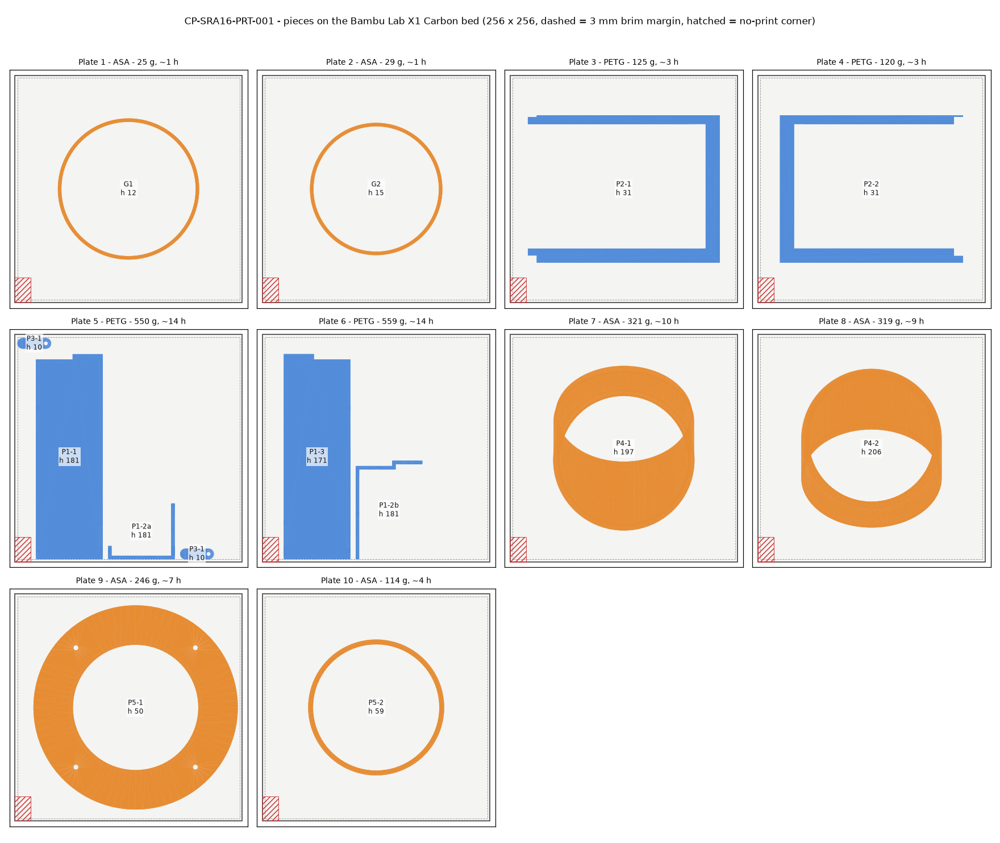
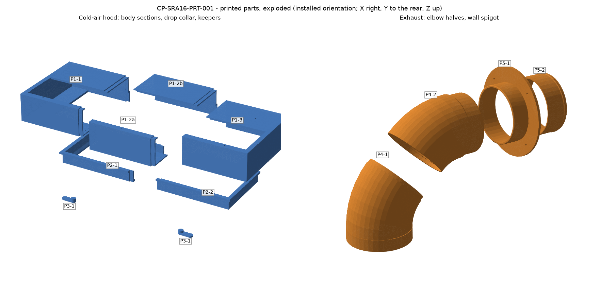

# SRA-16 - 3D-printed parts (CP-SRA16-PRT-001 rev A)

Generated by `tools/make_print_pack.py` from `rack_layout.py` v1.2.0 for the **Bambu Lab X1 Carbon**: 256 x 256 x 256 mm build volume, used as 250 x 250 x 250 so there is room for a brim and some headroom.

Every piece is split to fit, oriented to print **without supports**, and exported as an STL that already sits on the plate. The parts are built from the same model as the rest of the rack, so they follow any parameter change (re-run the tool after the tape checks).

| File | Use |
|---|---|
| `cad/print/stl/*.stl` | one STL per piece, print orientation |
| `cad/print/SRA16_print_x1c.zip` | the STLs + `PRINT_README.txt` (settings and plates) |
| `cad/print/SRA16_printed_parts.step` | every piece in its installed position; open with `SilentRackAC.step` |
| `bom/printed_parts.csv` | piece list with size, mass, time and plate |
| `cad/print/print_report.json` | all checks below |

## What is printed

| Part | Material | Pieces | Replaces | Why print it |
|---|---|---|---|---|
| P1 Cold-air hood body | PETG | P1-1, P1-2a, P1-2b, P1-3 | Cold air hood | The design already allowed a printed hood. Split into end sections and two middle channels. |
| P2 Hood drop collar | PETG | P2-1, P2-2 | Cold air hood | The model shows the drop collar fused to the hood; printed, it is a separate part that slides in the hood floor and rests on the AC top under its own weight. |
| P3 Collar keeper | PETG | P3-1 x2 | - | Turn buttons under the hood floor: lift the collar onto them to roll the AC in or out. |
| P4 Exhaust elbow | ASA | P4-1, P4-2 | Exhaust elbow (insulated) | The socket that fits over the AC spigot and the male outlet are custom; a stock elbow needs adapters. |
| P5 Exhaust wall spigot | ASA | P5-1, P5-2 | Exhaust wall spigot | The flange is drilled to the laser-cut rear-skin pattern; the outer tube carries a hose bead. |
| G Fit gauges | ASA | G1, G2 | - | Ten-minute prints that prove the two critical fits before the long prints. |

The cold side is PETG: it carries 12-18 degC air and copes with condensation. The hot side is ASA: the exhaust runs at up to about 60 degC, which is too close to PETG's softening point. Totals: PETG 8 pieces, about 1.35 kg and 35 h; ASA 6 pieces, about 1.05 kg and 32 h (solid-wall estimate, 0.4 mm nozzle).

## Pieces

| Piece | Qty | Material | Print size X x Y x Z mm | Mass g | Time h | Plate | On the plate |
|---|---:|---|---|---:|---:|---|---|
| P1-1 Hood body - left end | 1 | PETG | 75 x 231 x 181 | 419 | 10.4 | 5 | end wall on the plate, tongue up |
| P1-2a Hood body - middle, front channel | 1 | PETG | 75 x 63 x 181 | 125 | 3.3 | 5 | rebate end on the plate, tongue up |
| P1-2b Hood body - middle, rear channel | 1 | PETG | 75 x 111 x 181 | 158 | 4.1 | 6 | rebate end on the plate, tongue up |
| P1-3 Hood body - right end | 1 | PETG | 75 x 231 x 171 | 402 | 10.0 | 6 | end wall on the plate |
| P2-1 Drop collar - left half | 1 | PETG | 216 x 166 x 31 | 125 | 3.3 | 3 | lip on the plate |
| P2-2 Drop collar - right half | 1 | PETG | 206 x 166 x 31 | 120 | 3.2 | 4 | lip on the plate |
| P3-1 Collar keeper | 2 | PETG | 38 x 12 x 10 | 3 | 0.3 | 5 | arm on the plate, print 2 |
| P4-1 Exhaust elbow - inlet half (socket) | 1 | ASA | 159 x 185 x 197 | 321 | 9.5 | 7 | socket on the plate, tongue up |
| P4-2 Exhaust elbow - outlet half (spigot) | 1 | ASA | 158 x 179 x 206 | 319 | 9.5 | 8 | male spigot on the plate, rebate up |
| P5-1 Wall spigot - flange + inner tube | 1 | ASA | 230 x 230 x 50 | 246 | 7.3 | 9 | flange face (outside) on the plate |
| P5-2 Wall spigot - outer tube | 1 | ASA | 153 x 153 x 59 | 114 | 3.5 | 10 | hose end on the plate, tongue up |
| G1 Gauge - elbow socket over the AC spigot | 1 | ASA | 159 x 159 x 12 | 25 | 1.0 | 1 | print first |
| G2 Gauge - male spigot into the 150 duct | 1 | ASA | 149 x 149 x 15 | 29 | 1.1 | 2 | print first |

## Bambu Studio settings

**PETG** - cold side: hood, collar, keepers (water-resistant, tough; carries 12-18 degC air)

| Setting | Value |
|---|---|
| Filament | Bambu PETG HF (or any PETG), dried |
| Nozzle / layer | 0.4 mm / 0.20 mm (0.6 mm / 0.30 mm halves the hood time) |
| Walls | 4 wall loops, 5 top + 5 bottom layers: the 4 mm walls print solid |
| Infill | 15% gyroid (only the thick spots use it) |
| Plate | Textured PEI, no glue |
| Brim | 5 mm on the hood ends and the collar; 8 mm on the two middle channels (tall, narrow) |
| Supports | none - every piece is oriented to print without them |
| Cooling | profile default; open the top glass on a hot day (PETG clogs in a warm chamber) |

**ASA** - hot side: exhaust elbow, wall spigot and their gauges (exhaust air up to about 60 degC)

| Setting | Value |
|---|---|
| Filament | Bambu ASA (or any ASA), dried |
| Nozzle / layer | 0.4 mm / 0.20 mm |
| Walls | 4 wall loops, 5 top + 5 bottom layers |
| Infill | 15% gyroid |
| Plate | Textured PEI + glue stick |
| Brim | 5 mm on everything except the gauges |
| Supports | none |
| Chamber | door and lid closed, chamber warm before starting (warps less) |

Import the STLs as they are: they are already the right way up. Keep the filament's shrinkage compensation at its default and use the gauges (below) to confirm the fits.

## Plates

| Plate | Material | Pieces | Tallest mm | Mass g | Time h |
|---:|---|---|---:|---:|---:|
| 1 | ASA | G1 | 12 | 25 | 1.0 |
| 2 | ASA | G2 | 15 | 29 | 1.1 |
| 3 | PETG | P2-1 | 31 | 125 | 3.3 |
| 4 | PETG | P2-2 | 31 | 120 | 3.2 |
| 5 | PETG | P1-1, P1-2a, P3-1, P3-1 | 181 | 550 | 14.4 |
| 6 | PETG | P1-3, P1-2b | 181 | 559 | 14.1 |
| 7 | ASA | P4-1 | 197 | 321 | 9.5 |
| 8 | ASA | P4-2 | 206 | 319 | 9.5 |
| 9 | ASA | P5-1 | 50 | 246 | 7.3 |
| 10 | ASA | P5-2 | 59 | 114 | 3.5 |

## Print order

Plates are numbered in print order. Before printing anything, do the tape check (`DESIGN.md` section 3) and re-run this tool: **M1** (spigot OD) changes the elbow, the wall spigot and the gauges, and **M6** (louvre opening) changes the hood body and the collar. M2-M5 and hold point H1 only move the parts, so they do not change any STL.

1. **Gauges first (plates 1, 2).** G1 must slide over the AC exhaust spigot (M1, D150) with light friction. The 150 mm duct must slide over G2. If either is off, change `fit_socket` or `fit_spigot` in `tools/printparts.py` and re-run, or set the slicer's XY compensation, before the long prints.
2. **Collar (plates 3, 4).** Glue the halves; check the outline against the AC louvres.
3. **Hood and keepers (plates 5, 6).** Dry-fit the sections and check that the collar slides in the floor opening before gluing.
4. **Elbow and wall spigot (plates 7, 8, 9, 10)** in ASA.

## Assembly

**Hood body (P1).** Dry-fit first. The tongue on each section (inner half of the wall, 10 mm long) slides into the rebate on the next one with 0.2 mm clearance per face. Glue with two-part epoxy or a PETG-rated CA; the outside stays flush. Order: left end P1-1, then the two middle channels P1-2a and P1-2b on its tongues, then the right end P1-3 over both. Stick 3 x 10 mm closed-cell foam tape round the top face, offer the hood up under the shelf so the top opening lines up with the shelf opening, and screw it up into the ply with 6 x 4 mm x 20 pan-head screws through the holes in the top. Drive them from below with the AC out: the rear row through the floor opening, the front row through the 10 mm driver holes in the floor; then tape over the driver holes.

**Drop collar (P2).** Glue the two halves the same way. Bond the 10 x 10 EPDM gasket under the foot and run 3 x 10 mm closed-cell foam tape round the outside of the wall as a wiper. Drop it into the hood floor opening from below. It hangs on its lip (front and sides) when the AC is out and rests on the AC top under its own weight when the AC is in; the hood's rear bump gives it room to rise.

**Keepers (P3).** M4 x 25 up through each keeper and the hood floor, nyloc nut inside, snug enough that the keeper stays where it is turned. To roll the AC out: lift the collar 15 mm, turn both keepers under its front wall, roll the AC out (the elbow comes with it). To refit: roll the AC in, turn the keepers out, the collar drops onto the AC.

**Exhaust elbow (P4).** Slide the two halves together along the bend; the tongue on P4-1 goes into the rebate on P4-2. Solvent-weld with acetone (brush both faces, hold 1 minute) or ASA/ABS cement, then wrap the joint in aluminium tape. Wrap the elbow in 6 mm closed-cell insulation (the model allows 6 mm over the wall) and stick a 3 mm closed-cell foam ring on the 45 degree shoulder.

The elbow travels with the AC, because nobody can reach the duct joint once the AC is home. With the AC out, push the socket down over the AC spigot to the conical seat and tape it. Cut the internal 150 duct to **584 mm** (the model's 590 mm run, less the 4.5 mm shoulder, less half the foam ring), slide it onto the wall spigot's inner tube, and hang its front end from the shelf ply with a strap so that it lines up with the elbow outlet. As the AC is pushed home, the outlet slides 40 mm into the duct (the 1 mm chamfers lead it in) and the shoulder seals on the duct end.

**Wall spigot (P5).** Glue the outer tube P5-2 into the flange groove of P5-1 (its tongue). Put a 3 mm foam ring or a bead of silicone on the flange face, push the inner tube through the rear skin from outside, and bolt it with 4 x M5 x 25 through the skin holes (nyloc nuts inside; trim the foam lining round each nut). The internal duct slides over the inner tube; the external flex hose clamps behind the bead.

## Hardware for the printed parts

| Part | Item |
|---|---|
| P1 | 6 x 4 mm x 20 pan-head wood screws into the shelf ply |
| P1 | aluminium foil tape over the driver holes in the floor once the screws are in |
| P1 | 3 x 10 mm closed-cell foam tape on the top face (seal to the shelf) |
| P1 | epoxy or PETG-rated CA glue for the laps |
| P2 | 10 x 10 EPDM closed-cell strip under the foot (model part 'Hood gasket') |
| P2 | 3 x 10 mm closed-cell foam tape round the outside (wiper seal) |
| P2 | epoxy or PETG-rated CA glue for the laps |
| P3 | 2 x M4 x 25 button head + 2 x M4 nyloc + 4 washers |
| P4 | acetone (solvent-weld the lap) or ABS/ASA cement |
| P4 | aluminium foil tape |
| P4 | 6 mm self-adhesive closed-cell insulation, about 0.25 m2 |
| P4 | 3 mm closed-cell foam ring on the shoulder (seals on the duct end) |
| P4 | perforated hanger strap, about 0.4 m, + 2 screws into the shelf ply (holds the duct in line) |
| P5 | 4 x M5 x 25 button head + 4 x M5 nyloc + 8 washers |
| P5 | 3 mm closed-cell foam ring or silicone under the flange |
| P5 | acetone or ABS/ASA cement |

## Checks

| Check | Result |
|---|---|
| every piece fits the Bambu Lab X1 Carbon (250 x 250 x 250 usable, clear of the 18x28 corner) | OK |
| every piece is one valid closed solid | OK |
| P1 sections: no overlap, volume adds up | OK - overlap 0.000 mm3, part 870661, sections 869068, glue clearance 1593 mm3 |
| P2 sections: no overlap, volume adds up | OK - overlap 0.000 mm3, part 192912, sections 192746, glue clearance 166 mm3 |
| P4 sections: no overlap, volume adds up | OK - overlap 0.000 mm3, part 599468, sections 598291, glue clearance 1177 mm3 |
| hood top opening = shelf cold opening | OK - 66.2-556.2 x 54.2-159.2 |
| collar foot clears the AC outlet by the hood margin | OK - min margin 15.0 mm (hood_margin 15) |
| collar seats on the model hood gasket (same outline and hole) | OK - gasket 400.0 x 160.0, hole 380.0 x 140.0 |
| every hood screw can be driven straight up from below (floor opening or driver hole) | OK - 6 screws, 3 through driver holes |
| raised collar + gasket clears the AC top | OK - 15.0 mm |
| elbow socket slides over the AC spigot | OK - socket bore D151.0 over spigot D150.0, seat D144.0 |
| elbow outlet spigot fits inside the duct | OK - OD 149.0 in duct bore 150.0 |
| elbow outlet on the duct axis | OK - x 441.7 z 752.0 |
| wall spigot inner tube passes the skin hole and fits the duct | OK - OD 149.0, skin hole D152.0, duct bore 150.0 |
| flange bolt holes = rear-skin M5 holes (DXF) | OK - 4 x D5.5 on PCD 190.0, flange D230 |
| every STL is closed, consistently wound and matches its solid (<1% volume) | OK |
| no overhang steeper than 50 deg off vertical wider than 6 mm (prints without supports) | OK |
| no clash with the 161 other rack parts or each other - running (collar on the AC) | OK - internal duct cut to 584 mm, sealing on the elbow shoulder |
| no clash with the 161 other rack parts or each other - service (collar on the keepers) | OK - internal duct cut to 584 mm, sealing on the elbow shoulder |
| no clash with the 161 other rack parts or each other - AC out (collar hanging) | OK - internal duct cut to 584 mm, sealing on the elbow shoulder |

## Design notes

- **Walls** 4 mm (the model's hood is 6 mm PP). Laps are half the wall, 10 mm long; clearance 0.2 mm per face leaves room for glue.
- **Sections.** The hood body is a profile run along X, so it prints standing on end and every wall is vertical. Between the end walls the top and floor openings split it into a front and a rear channel, so the middle section is two prints.
- **Collar.** Outer 400 x 160 mm, the same outline as the model's hood gasket; the foot opening (380 x 140) clears the AC outlet by the full hood margin. Running clearance 2 mm per side, taken up by the foam wiper. It drops 3 mm when the AC is out and lifts 15 mm onto the keepers.
- **Hood rear bump.** The hood's rear wall steps out 6 mm below z 1046 so the collar can rise past it; above that the wall stays in front of the shelf's foam lining.
- **Elbow.** Split at 45 degrees so each half stands on a straight end and leans at most 45 degrees. The AC spigot stops on a conical seat at the top of the socket.
- **Overhangs.** The check flags every face that leans more than 50 degrees from vertical. The only ones are narrow strips (lap steps, small horizontal holes, the flange groove), at most 2.5 mm wide, which print as short bridges.
- **Other printers.** `--printer p1s` or `--printer a1` gives the same pieces (same 256 mm bed). The A1 mini (180 mm) is too small for the hood profile, the elbow halves and the flange; `--printer a1mini` lists what does not fit. Printers known: x1c (Bambu Lab X1 Carbon), p1s (Bambu Lab P1S), a1 (Bambu Lab A1), a1mini (Bambu Lab A1 mini).
